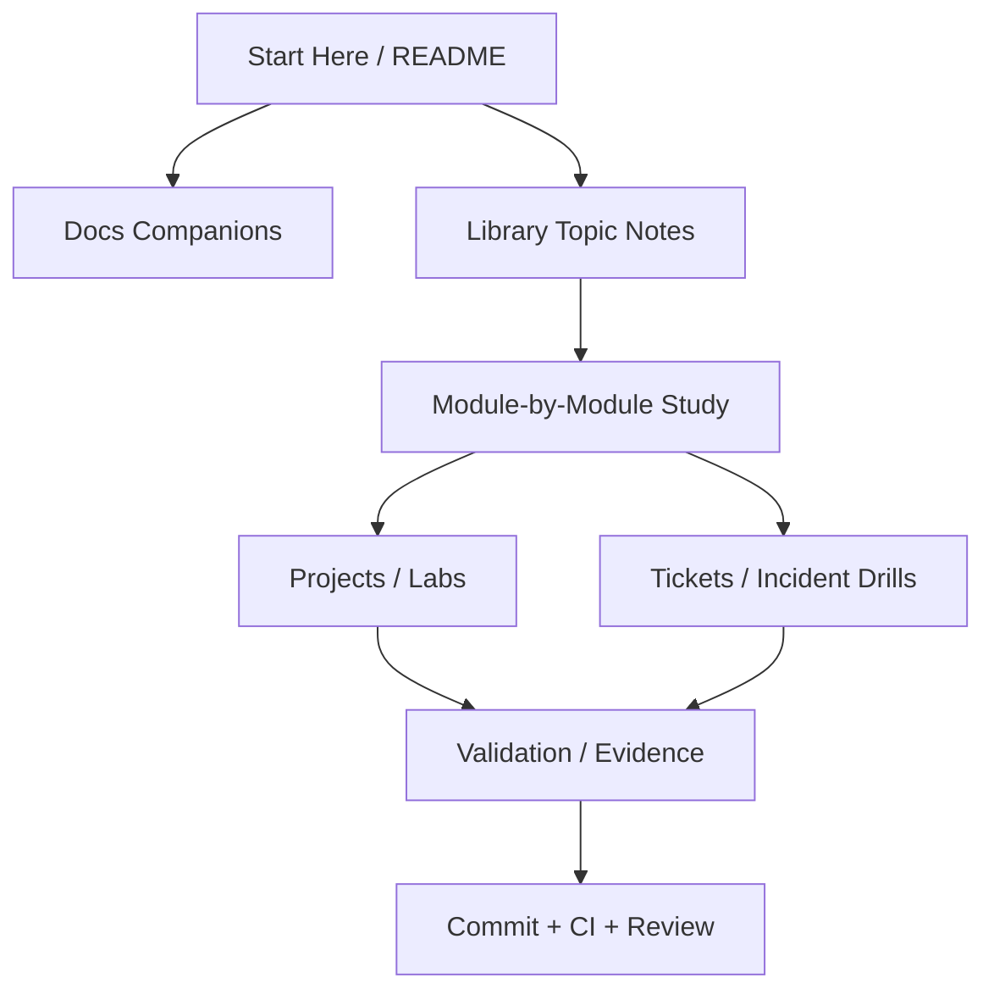
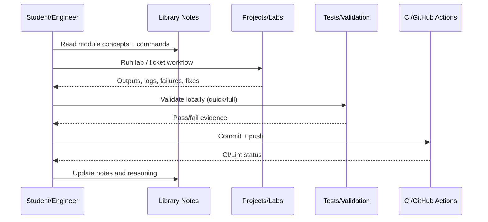
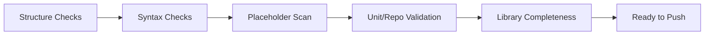

# DevOps Mastery Lab Full Course Master Guide (Single-File)

Author: Simon Parris + Codex consolidation pass
Date: 2026-02-24
Format: One-file course notes guide (Markdown) with diagrams and source map

This file consolidates the course notes into one markdown guide for offline/mobile review.
It preserves the modular `Library/*.md` files while providing a single-file study and revision path.

## What This Guide Includes

- Course map and study flow diagrams
- Quality/verification checklist aligned to repo CI and validation scripts
- Source map for `Library/`, `docs/`, `projects/`, and `tickets/`
- Combined notes from the `Library/` topic files in one place

## Course Architecture Diagram



## Learning Loop Diagram



## Quality Gate Diagram



## Source Map

### Library Files Included in This Guide

- `Library/00_full_course_q_and_a_sheet.md`
- `Library/00_full_lesson_and_ticket_demo_sheet.md`
- `Library/00_universal_devops_concepts.md`
- `Library/01_linux_and_system_administration.md`
- `Library/02_containers_and_docker.md`
- `Library/03_monitoring_and_observability.md`
- `Library/04_infrastructure_as_code.md`
- `Library/05_kubernetes.md`
- `Library/06_gitops_and_version_control.md`
- `Library/07_cicd_and_devsecops.md`
- `Library/08_sre_and_incident_management.md`
- `Library/09_deployment_strategies.md`
- `Library/10_networking_and_enterprise_infrastructure.md`

### Companion Docs (Referenced)

- `docs/LESSON_EXECUTION_COMPANION.md`
- `docs/LESSON_RESEARCH_ANALYSIS_COMPANION.md`
- `docs/OFFLINE_INDEX.md`
- `docs/PROJECT_MANUAL.md`
- `docs/PROJECT_RUNBOOKS_DETAILED.md`
- `docs/README.md`
- `docs/REPOSITORY_STATUS_REPORT.md`
- `docs/aviation-platform-architecture.md`
- `docs/aviation-scale-devops-incidents-lab.md`
- `docs/blue-green-deployment-lab.md`
- `docs/devsecops-cicd-lab.md`
- `docs/docker-production-lab.md`
- `docs/enterprise-devops-incidents-lab.md`
- `docs/enterprise-infrastructure-audit-refactor-program.md`
- `docs/enterprise-networking-lab.md`
- `docs/git-github-setup.md`
- `docs/github-actions-cicd-lab.md`
- `docs/gitops-workflow-lab.md`
- `docs/kubernetes-local-lab.md`
- `docs/linux-mastery-lab.md`
- `docs/monitoring-stack-lab.md`
- `docs/sre-simulation-lab.md`
- `docs/terraform-local-infra-lab.md`
- `docs/ticket-demo-index.md`

### Project and Ticket/Lab Paths (Top-Level Pointers)

- `projects/`
- `tickets/`

## Combined Library Notes

_The sections below are combined from the modular `Library/*.md` files to create a single-file course guide._


---

## Source File: `Library/00_full_course_q_and_a_sheet.md`

# DevOps Full Course Q and A Sheet (Master)

Author: Simon Parris + additive Codex library extension
Date: 2026-02-23
Mode: GitHub mobile / CLI study companion

This is a single, full question-and-answer sheet for the DevOps repository.

It does not replace the lesson notes. It explains how the whole course fits together, what each lesson is training, and how to think while working in the CLI.

## How To Use This Sheet

1. Read the course-level Q and A first.
2. Use the lesson Q and A for the section you are on.
3. Run commands from `projects/section-walkthroughs/` in another terminal.
4. Use the ticket Q and A before and after each incident drill.

## Course-Level Q and A

### Q1. What type of software engineering is DevOps in this repo?

DevOps here is software engineering for delivery and operations systems.

It combines:

- software engineering (automation, CI/CD, release discipline)
- systems engineering (Linux, processes, networking, logging)
- platform engineering (containers, Kubernetes, GitOps)
- reliability engineering (monitoring, SLOs, incidents)
- security engineering in delivery pipelines (DevSecOps)

You are not only building app code. You are building and operating the system that builds, ships, runs, and recovers app code.

### Q2. Why does the course start with Linux instead of Kubernetes or CI/CD?

Because every later tool depends on Linux behavior.

If you do not understand:

- processes
- services
- ports
- permissions
- logs
- memory/disk pressure

then Docker and Kubernetes failures feel random. Linux gives you the base debugging vocabulary.

### Q3. What is the main learning pattern used across this DevOps repo?

The repeating pattern is:

1. Build or start a system.
2. Verify expected behavior.
3. Introduce a controlled failure.
4. Collect evidence before changing anything.
5. Apply the smallest fix.
6. Verify the fix.
7. Reset and repeat.

This is real operations behavior, not only tutorial behavior.

### Q4. How should I think when a lab fails?

Classify the failure layer first.

Use this order:

1. Environment / prerequisites missing?
2. Build/config generation failed?
3. Runtime process/container/pod failed to start?
4. Network/routing/port problem?
5. Application logic/runtime problem?
6. Monitoring/visibility gap making diagnosis harder?

This prevents random trial-and-error fixes.

### Q5. What does "evidence" mean in this course?

Evidence means commands and outputs that prove a claim.

Examples:

- `docker ps` proves container state.
- `kubectl describe pod` proves scheduling/probe/image events.
- `ss -tulpn` proves port listeners.
- `journalctl` proves host/service logs.
- Grafana/Prometheus metrics prove latency, errors, or saturation.
- ArgoCD status proves GitOps sync/drift state.

Evidence is not "I think this is the issue."

### Q6. Why are there both lesson notes and ticket demos?

They train different skills.

- Lesson notes teach concepts and normal workflows.
- Ticket demos train incident handling and pattern recognition.

If you skip tickets, you may understand the tools but still struggle in real debugging situations.

### Q7. What is the difference between DevOps, SRE, and Platform Engineering in this repo?

They overlap but focus on different questions.

- DevOps: how code moves safely from commit to runtime.
- Platform Engineering: how the runtime/deployment platform is built and maintained.
- SRE: how reliability targets are defined, monitored, and defended during incidents.

This repo intentionally includes all three because real teams mix them.

### Q8. What does "GitHub/iPhone readable" mean in practice?

It means the notes are designed so you can read them on a phone while running commands on another screen.

Practical rules used:

- short sections
- no wide tables
- explicit numbered steps
- direct command blocks
- plain-language definitions

### Q9. How do I know I am actually learning and not just copying commands?

You can answer three things after each lab:

1. What failed (or what could fail)?
2. What command proved it?
3. Why did the fix work?

If you can answer those without guessing, the learning is real.

### Q10. What should my default CLI study workflow be?

Use this pattern:

```bash
# terminal A (doing)
cd /home/sp/cyber-course/projects/DevOps

# terminal B (reading)
less docs/LESSON_EXECUTION_COMPANION.md
# or open the matching file in GitHub mobile
```

Then run the section's `Step 1-5` from `projects/section-walkthroughs/`.

## Lesson-by-Lesson Q and A (Sections 1-16)

### Lesson 1 (Linux Mastery)

Q: What is the core skill?
A: Host-level debugging fluency: permissions, processes, services, logs, ports, disk, memory, networking.

Q: What is the main question to ask?
A: Is this a process issue, service issue, permission issue, or port issue?

Q: What proves progress?
A: You can use `ps`, `systemctl`, `journalctl`, `ss`, `df`, and `free` to explain a system symptom.

### Lesson 2 (Docker Production Lab)

Q: What is the core skill?
A: Container incident classification across image build, container startup, networking/ports, and app runtime.

Q: Why this matters?
A: Docker is the first place multiple layers meet (build, OS, networking, app process).

Q: What proves progress?
A: You can diagnose a crash loop or port conflict using `docker compose ps`, `docker logs`, and `docker inspect`.

### Lesson 3 (Monitoring Stack)

Q: What is the core skill?
A: Observability reasoning: turning symptoms into metrics and logs.

Q: What is the key concept?
A: Metrics and logs answer different questions. Use both.

Q: What proves progress?
A: You can point to a graph/log signal and explain what system behavior caused it.

### Lesson 4 (Terraform Local Infrastructure)

Q: What is the core skill?
A: Predictable infrastructure change using `plan`, `apply`, `state`, and drift detection.

Q: Why local files instead of cloud first?
A: You can practice the logic of Terraform without cloud cost/risk.

Q: What proves progress?
A: You can explain the plan, apply once, then show idempotency with a second plan.

### Lesson 5 (Kubernetes Local Platform)

Q: What is the core skill?
A: Debugging desired state vs actual cluster state using `kubectl`.

Q: What is the main habit?
A: Inspect resources and events before patching manifests.

Q: What proves progress?
A: You can localize failure to pods, services, ingress, config, or resource limits.

### Lesson 6 (GitOps Workflow)

Q: What is the core skill?
A: Operating Kubernetes deployments through Git and a reconciler (ArgoCD).

Q: What is the key lesson?
A: Manual cluster changes are temporary unless committed to Git.

Q: What proves progress?
A: You can create/observe drift and explain how reconciliation restores desired state.

### Lesson 7 (DevSecOps CI/CD)

Q: What is the core skill?
A: Understanding what each CI security control protects against.

Q: What common mistake does this lesson prevent?
A: Treating security checks as random noise instead of risk controls.

Q: What proves progress?
A: You can map scanner/tool -> risk type -> limitation.

### Lesson 8 (SRE Simulation)

Q: What is the core skill?
A: Converting monitoring data into reliability decisions using SLIs, SLOs, and error budgets.

Q: What is the key concept?
A: Incidents must be described in both user impact language and metric language.

Q: What proves progress?
A: You can explain why a mitigation was justified based on SLI/SLO impact.

### Lesson 9 (Blue/Green Deployment)

Q: What is the core skill?
A: Safe release execution using traffic routing, canary percentages, and rollback.

Q: What important distinction is taught?
A: Deployment success (new version started) is not release success (safe traffic + healthy behavior).

Q: What proves progress?
A: You can run a canary, interpret health, and rollback correctly.

### Lesson 10 (Aviation-Scale DevOps Incidents)

Q: What is the core skill?
A: Cross-layer reasoning under complex incident conditions.

Q: Why "aviation-scale" framing?
A: It forces you to think about blast radius, dependencies, and operational discipline.

Q: What proves progress?
A: You can separate root cause from downstream symptoms across layers.

### Lesson 11 (Aviation Platform Architecture)

Q: What is the core skill?
A: Reading architecture as operational decisions (security, failure domains, DR, scalability, cost).

Q: Why is architecture in a hands-on repo?
A: Better debugging comes from understanding how systems should be designed to fail safely.

Q: What proves progress?
A: You can explain request path, deployment path, failure boundaries, and recovery strategy.

### Lesson 12 (Enterprise Networking)

Q: What is the core skill?
A: Layer-by-layer network troubleshooting (DNS -> TCP -> TLS -> HTTP) using evidence.

Q: What is the main habit?
A: Find the first failing protocol layer before changing configs.

Q: What proves progress?
A: You can state which layer failed and what command or capture proves it.

### Lesson 13 (Enterprise Audit and Refactor Program)

Q: What is the core skill?
A: Reviewing modules against production-grade standards and producing a remediation sequence.

Q: What is different from a normal code review?
A: This is a program-level hardening plan, not just file-by-file cleanup.

Q: What proves progress?
A: You can produce a prioritized audit checklist with acceptance criteria.

### Lesson 14 (Enterprise DevOps Incidents)

Q: What is the core skill?
A: Incident triage and RCA using hypotheses, evidence, mitigation, and prevention.

Q: What common mistake does it prevent?
A: Confusing mitigation (reduce impact now) with permanent fix (remove root cause).

Q: What proves progress?
A: Your incident write-up clearly separates symptoms, root cause, mitigation, and prevention.

### Lesson 15 (GitHub Actions CI/CD Lab)

Q: What is the core skill?
A: Reading and troubleshooting CI/CD workflows as production systems.

Q: What do you need to classify quickly?
A: Code issue, config issue, permissions issue, environment issue, or tooling issue.

Q: What proves progress?
A: You can map failed job/step to the smallest viable fix.

### Lesson 16 (Ticket Demo Library)

Q: What is the core skill?
A: Repeatable incident practice using reproduce -> debug -> fix -> verify -> reset.

Q: Why is reset required?
A: Repeatability is the training mechanism. No reset means less practice value.

Q: What proves progress?
A: You can complete tickets without skipping evidence or reset.

## Ticket Styles Q and A (All Ticket Types in This Repo)

### Docker Ticket Styles (`tickets/docker/`)

Q: What Docker ticket styles are included?
A: Crash loop, port conflict, volume permission error, broken entrypoint, and OOM.

Q: What do these teach together?
A: Startup failures, runtime failures, host/container interface problems, and resource exhaustion.

Q: What is the correct workflow?
A: Reproduce -> inspect status -> inspect logs -> identify root cause -> fix -> reset.

### CI/CD Ticket Styles (`tickets/cicd/`)

Q: What CI/CD ticket styles are included?
A: Lint failure, test matrix failure, Docker build failure, semantic-release permission failure, GHCR publish permission failure.

Q: What do these teach together?
A: Pipeline stage classification, matrix compatibility, build context errors, and GitHub token permission scoping.

Q: What is the correct workflow?
A: Classify failed job -> inspect job logs -> reproduce locally if possible -> apply minimal workflow/code fix -> rerun.

## Most Important DevOps Q and A (Keep This Handy)

### Q: What command should I run first during an incident?

A: Run the smallest command that gives state, not a change.

Examples:

- `docker compose ps`
- `kubectl get pods -A`
- `ss -tulpn`
- `journalctl -n 50 --no-pager`
- `terraform plan`

### Q: What should I avoid doing first?

A: Avoid blind restarts, random config edits, and changing multiple things at once.

### Q: What is the fastest way to improve in this repo?

A: Repeat the same ticket/lab after reset and compare your evidence collection speed and accuracy.

## Cross-References (Use With This Sheet)

- `projects/section-walkthroughs/README.md`
- `docs/LESSON_EXECUTION_COMPANION.md`
- `docs/LESSON_RESEARCH_ANALYSIS_COMPANION.md`
- `tickets/README.md`


---

## Source File: `Library/00_full_lesson_and_ticket_demo_sheet.md`

# DevOps Full Lesson and Ticket Demo Sheet (Master CLI)

Author: Simon Parris + additive Codex library extension
Date: 2026-02-23
Mode: Full CLI execution + GitHub mobile reading support

This is a single, ordered demo sheet for all DevOps lessons and all ticket styles in this repo.

Use this when you want to run the course end-to-end from the CLI and still understand what each command is proving.

## Before You Start (CLI Session Setup)

```bash
cd /home/sp/cyber-course/projects/DevOps
pwd
git status --short
```

What you are doing: confirming repository context and seeing local changes before running labs.

## Global Rule For Every Demo

1. Read the target lesson/ticket first.
2. Run the smallest verify command before changing anything.
3. Capture evidence.
4. Make one change.
5. Verify and reset.

## Lesson Demo Order (1-16)

### Lesson 1 Demo - Linux Mastery

```bash
cd /home/sp/cyber-course/projects/DevOps
sed -n '1,120p' docs/linux-mastery-lab.md
whoami
uname -a
ss -tulpn | head -30
df -h
free -h
journalctl -n 30 --no-pager
```

What this proves: you can collect baseline host evidence before touching containers or clusters.

### Lesson 2 Demo - Docker Production Lab

```bash
cd projects/docker-production-lab
docker compose up -d --build
docker compose ps
curl http://127.0.0.1:8080/health
docker compose logs --tail=100
```

What this proves: image builds, container starts, port binds, and app health works.

Reset:

```bash
docker compose down -v --remove-orphans
```

### Lesson 3 Demo - Monitoring Stack

```bash
cd ../monitoring-stack-lab
./scripts/start.sh
./scripts/smoke_test.sh
./scripts/generate_traffic.sh http://127.0.0.1:8000 60 12 20
./scripts/simulate_cpu_spike.sh http://127.0.0.1:8000 20 2
```

What this proves: observability stack is running and can show workload/signal changes.

Reset:

```bash
./scripts/stop.sh
./scripts/reset.sh
```

### Lesson 4 Demo - Terraform Local Infrastructure

```bash
cd ../terraform-local-infra-lab
cp terraform.tfvars.example terraform.tfvars
./scripts/init.sh
./scripts/plan.sh
./scripts/apply.sh -auto-approve
terraform output
./scripts/plan.sh
```

What this proves: init/plan/apply flow works and you can check idempotency.

Reset:

```bash
./scripts/destroy.sh -auto-approve
./scripts/reset.sh
```

### Lesson 5 Demo - Kubernetes Local Platform

```bash
cd ../kubernetes-local-lab
./scripts/start_minikube.sh
./scripts/apply_base.sh
kubectl -n platform-lab get deploy,rs,pods,svc,ingress,cm,secret,hpa
curl -H 'Host: podinfo.local' http://$(minikube ip)
```

What this proves: local cluster + base workloads + ingress path work.

Cleanup (keep cluster if moving to GitOps next):

```bash
./scripts/delete_base.sh
```

### Lesson 6 Demo - GitOps Workflow

```bash
cd ../gitops-workflow-lab
./scripts/install_argocd_minikube.sh
./scripts/bootstrap_argocd_apps.sh
kubectl -n argocd get applications.argoproj.io
./scripts/render_overlay.sh dev
./scripts/render_overlay.sh prod
./scripts/show_version_matrix.sh
```

What this proves: ArgoCD apps exist and overlay rendering/version mapping can be inspected before sync troubleshooting.

Drift demo:

```bash
./scripts/simulate_config_drift.sh
kubectl -n platform-prod scale deploy/podinfo --replicas=7
kubectl -n argocd get applications.argoproj.io podinfo-prod
```

What this proves: manual drift is visible to GitOps reconciliation.

### Lesson 7 Demo - DevSecOps CI/CD

```bash
cd ../github-actions-ci-demo
ls .github/workflows
rg -n 'trivy|gitleaks|codeql|audit|dependency-review' .github/workflows/*.yml
ls examples/secure-nginx
sed -n '1,160p' examples/secure-nginx/Dockerfile
sed -n '1,160p' examples/secure-nginx/Dockerfile.insecure
```

What this proves: you can map security controls to real workflows and compare hardened vs insecure examples.

### Lesson 8 Demo - SRE Simulation

```bash
cd ../monitoring-stack-lab
./scripts/start.sh
./scripts/smoke_test.sh
cd ../sre-simulation-lab
./scripts/preflight.sh
./scripts/error_budget_calc.sh 99.9 30
./scripts/simulate_5xx_surge.sh 80
./scripts/incident_snapshot.sh
```

What this proves: reliability math + incident evidence workflow are working against the monitoring dependency.

### Lesson 9 Demo - Blue/Green Deployment

```bash
cd ../blue-green-deployment-lab
./scripts/start.sh
./scripts/status.sh
./scripts/set_canary.sh 10
./scripts/sample_traffic.sh 50
./scripts/simulate_bad_deployment.sh
./scripts/rollback_to_blue.sh
```

What this proves: canary routing, bad deploy simulation, and rollback workflow all function.

Reset:

```bash
./scripts/stop.sh
./scripts/reset.sh
```

### Lesson 10 Demo - Aviation-Scale Incidents (Reading + Analysis Demo)

```bash
cd /home/sp/cyber-course/projects/DevOps
rg -n '^## Scenario ' docs/aviation-scale-devops-incidents-lab.md
sed -n '39,120p' docs/aviation-scale-devops-incidents-lab.md
sed -n '59,170p' docs/aviation-scale-devops-incidents-lab.md
```

What this proves: you can use the reusable cross-layer workflow and analyze a full scenario from the CLI.

### Lesson 11 Demo - Aviation Platform Architecture (Reading + Review Demo)

```bash
rg -n '^## ' docs/aviation-platform-architecture.md
sed -n '35,140p' docs/aviation-platform-architecture.md
sed -n '255,370p' docs/aviation-platform-architecture.md
sed -n '370,520p' docs/aviation-platform-architecture.md
```

What this proves: you can read architecture as operations design (traffic path, failure domains, security, scaling, cost).

### Lesson 12 Demo - Enterprise Networking

```bash
cd projects/enterprise-networking-lab
./scripts/preflight.sh
./scripts/capture_dns_path.sh api.company.aero eth0
./scripts/capture_tls_handshake.sh api.company.aero 443 eth0
./scripts/capture_http_timeout.sh api.company.aero 443 eth0
```

What this proves: you can generate layered troubleshooting command recipes (DNS/TLS/HTTP timeout) for real investigations.

### Lesson 13 Demo - Enterprise Audit and Refactor Program

```bash
cd /home/sp/cyber-course/projects/DevOps
sed -n '1,120p' docs/enterprise-infrastructure-audit-refactor-program.md
sed -n '102,236p' docs/enterprise-infrastructure-audit-refactor-program.md
sed -n '640,760p' docs/enterprise-infrastructure-audit-refactor-program.md
```

What this proves: you can convert lab maturity gaps into a standards-based remediation plan.

### Lesson 14 Demo - Enterprise DevOps Incidents

```bash
sed -n '1,90p' docs/enterprise-devops-incidents-lab.md
rg -n '^## (1[0-5]|[1-9])\.' docs/enterprise-devops-incidents-lab.md
sed -n '42,104p' docs/enterprise-devops-incidents-lab.md
sed -n '506,560p' docs/enterprise-devops-incidents-lab.md
```

What this proves: you can apply a repeatable triage workflow to realistic enterprise incident scenarios.

### Lesson 15 Demo - GitHub Actions CI/CD Lab

```bash
sed -n '1,220p' docs/github-actions-cicd-lab.md
cd projects/github-actions-ci-demo
ls .github/workflows
cat package.json
npm run lint
npm run build
```

What this proves: you can map CI/CD stages and locally reproduce simple pipeline stages.

### Lesson 16 Demo - Ticket Demo Library

```bash
cd /home/sp/cyber-course/projects/DevOps
sed -n '1,220p' tickets/README.md
ls -1 tickets/docker
ls -1 tickets/cicd
```

What this proves: you can select and sequence repeatable incident drills by category.

## Ticket Demo Coverage (All Ticket Styles)

### Docker Ticket Demos (`tickets/docker/`)

#### TKT-001 Crash Loop

```bash
cd /home/sp/cyber-course/projects/DevOps/projects/docker-production-lab
docker build -t docker-prod-lab:prod .
./scripts/simulate_crash_loop.sh
docker ps -a --filter name=crash-loop
docker inspect -f 'status={{.State.Status}} exit={{.State.ExitCode}} restarts={{.RestartCount}}' crash-loop
docker logs crash-loop --tail 50
docker rm -f crash-loop
```

What this teaches: startup exit loops and evidence collection via `inspect` + `logs`.

#### TKT-002 Port Conflict

```bash
cd /home/sp/cyber-course/projects/DevOps/projects/docker-production-lab
./scripts/simulate_port_conflict.sh
docker run --name app-port-conflict -p 8080:8080 docker-prod-lab:prod
docker ps --format 'table {{.Names}}\t{{.Ports}}'
ss -tulpn | rg ':8080|:80' || true
docker rm -f port-holder app-port-conflict
```

What this teaches: host port binding collisions and verification using container port maps plus socket state.

#### TKT-003 Volume Permission Error

```bash
cd /home/sp/cyber-course/projects/DevOps/projects/docker-production-lab
./scripts/simulate_volume_permission_error.sh
docker ps -a --filter name=volume-perm
docker logs volume-perm --tail 50
ls -ld hostdata-bad
docker rm -f volume-perm
```

What this teaches: host filesystem permissions vs container runtime user expectations.

#### TKT-004 Broken Entrypoint

```bash
cd /home/sp/cyber-course/projects/DevOps/projects/docker-production-lab
./scripts/simulate_broken_entrypoint.sh
docker image inspect docker-prod-lab:prod --format '{{json .Config.Entrypoint}} {{json .Config.Cmd}}'
docker run --rm --entrypoint sh docker-prod-lab:prod -c 'ls -l /app && head -n 3 /app/entrypoint.sh'
```

What this teaches: command/entrypoint misconfiguration and image-level startup diagnostics (no long-running container expected).

#### TKT-005 OOM

```bash
cd /home/sp/cyber-course/projects/DevOps/projects/docker-production-lab
./scripts/simulate_oom.sh
docker ps -a --filter name=oom-lab
docker inspect -f 'exit={{.State.ExitCode}} oom={{.State.OOMKilled}}' oom-lab
docker logs oom-lab --tail 50
docker stats --no-stream
docker rm -f oom-lab
```

What this teaches: resource exhaustion symptoms and OOM evidence checks.

### CI/CD Ticket Demos (`tickets/cicd/`)

These tickets are primarily GitHub workflow log analysis drills. Use the local repo to reproduce what is reproducible, then inspect GitHub Actions logs for the rest.

#### TKT-101 Lint Failure

```bash
cd /home/sp/cyber-course/projects/DevOps
sed -n '1,120p' tickets/cicd/TKT-101-lint-failure/README.md
cd projects/github-actions-ci-demo
npm run lint
```

What this teaches: stage classification and local reproduction of lint failures.

#### TKT-102 Test Matrix Failure

```bash
cd /home/sp/cyber-course/projects/DevOps
sed -n '1,120p' tickets/cicd/TKT-102-test-matrix-failure/README.md
cd projects/github-actions-ci-demo
cat package.json
```

What this teaches: version-specific failures and matrix reasoning (compare Node versions in CI logs).

#### TKT-103 Docker Build Failure

```bash
cd /home/sp/cyber-course/projects/DevOps
sed -n '1,120p' tickets/cicd/TKT-103-docker-build-failure/README.md
cd projects/github-actions-ci-demo/examples/secure-nginx
docker build -t local-secure-nginx .
```

What this teaches: Docker build verify failures and local reproduction of CI build errors.

#### TKT-104 Semantic Release Permission Failure

```bash
cd /home/sp/cyber-course/projects/DevOps
sed -n '1,120p' tickets/cicd/TKT-104-semantic-release-permission/README.md
cd projects/github-actions-ci-demo
rg -n 'permissions:|contents:|fetch-depth' .github/workflows/*.yml
```

What this teaches: GitHub Actions token scopes and release workflow requirements.

#### TKT-105 GHCR Publish Permission Failure

```bash
cd /home/sp/cyber-course/projects/DevOps
sed -n '1,120p' tickets/cicd/TKT-105-ghcr-publish-permission/README.md
cd projects/github-actions-ci-demo
rg -n 'permissions:|packages:|ghcr' .github/workflows/*.yml
```

What this teaches: registry auth/publish permission troubleshooting.

## CLI + GitHub Combined Workflow (Recommended)

1. Read the lesson or ticket in GitHub mobile.
2. Run the demo commands in the CLI.
3. Write a 5-line note:
   - symptom or goal
   - command used
   - evidence found
   - fix or conclusion
   - reset confirmation
4. Repeat once to improve speed and accuracy.

## Cross-References

- `Library/00_full_course_q_and_a_sheet.md`
- `projects/section-walkthroughs/README.md`
- `docs/LESSON_EXECUTION_COMPANION.md`
- `tickets/README.md`


---

## Source File: `Library/00_universal_devops_concepts.md`

# Universal DevOps Concepts

---

> **Field** — DevOps / Cross-Disciplinary Foundations
> **Scope** — Terms used across every lesson in this repository

---

## Overview

These definitions apply everywhere in DevOps. They are
the shared vocabulary for debugging, incident management,
and operational reasoning. Every other Library file builds
on these terms.

---

## Definitions

### `System`

**Definition.**
A set of parts working together to produce a result.
An app, a container, a network, or a full pipeline
can each be called a system.

**Context.**
When something breaks, the first question is always
"which system?" Naming the system narrows the search.

**Example.**
"The monitoring system is down" is more useful than
"something is broken."

---

### `Layer`

**Definition.**
One level in a technology stack. Each layer has its
own tools, failure modes, and evidence sources.

**Context.**
DevOps problems usually live in one layer. Identifying
the layer avoids wasting time in the wrong place.

**Example.**
A web request passes through layers: DNS, TCP, TLS,
HTTP, application code, database.

---

### `Symptom`

**Definition.**
What you observe when something goes wrong. An error
message, a timeout, a failed health check, or a
missing response are all symptoms.

**Context.**
Symptoms tell you something is wrong but not why.
Never skip from symptom to fix without evidence.

**Example.**
"Connection refused on port 8080" is a symptom.
The cause might be a stopped service, a firewall
rule, or a port conflict.

---

### `Root Cause`

**Definition.**
The actual reason a symptom happened. It is the
deepest change or condition that, if removed,
would prevent the symptom.

**Context.**
Fixing a symptom without finding the root cause
leads to repeat incidents. Root cause analysis
is a core DevOps and SRE practice.

**Example.**
Symptom: container keeps restarting.
Root cause: entrypoint script references a file
that was removed in the latest image build.

---

### `Evidence`

**Definition.**
Output, logs, metrics, or command results that
support or reject a hypothesis about what went wrong.

**Context.**
Evidence-based debugging means collecting proof
before applying fixes. This separates professional
operations from guesswork.

**Example.**
```bash
docker logs my-app 2>&1 | tail -20
```
The log output is evidence of what the container
did before it failed.

---

### `Hypothesis`

**Definition.**
A possible explanation for a problem that you
test with evidence. You either confirm it or
rule it out.

**Context.**
Good debugging generates hypotheses and tests
them one at a time. This prevents random changes.

**Example.**
Hypothesis: "The app crashed because the database
connection string is wrong."
Test: check the environment variable and database
reachability.

---

### `Mitigation`

**Definition.**
A fast action that reduces user impact right now,
even if it does not fix the root cause.

**Context.**
In live incidents, mitigation comes first. You
stabilize the system, then investigate the cause.

**Example.**
Rolling back to the previous container image to
restore service while investigating why the new
image fails.

---

### `Permanent Fix`

**Definition.**
A change that removes the root cause so the
problem does not recur.

**Context.**
Mitigations are temporary. Permanent fixes are
tracked through change management and tested
before deployment.

**Example.**
Fixing the broken entrypoint script, rebuilding
the image, and adding a CI test to catch the
issue in future builds.

---

### `Prevention`

**Definition.**
A control or practice that lowers the chance
of a problem happening again in the future.

**Context.**
Prevention is the final step in incident
response. It turns one incident into improved
system resilience.

**Example.**
Adding a health check to the deployment manifest
so Kubernetes automatically restarts unhealthy pods
before users notice.

---

### `Blast Radius`

**Definition.**
How many users, systems, or services are affected
by a failure or change.

**Context.**
Smaller blast radius means less risk. Deployment
strategies like canary releases exist specifically
to limit blast radius.

**Example.**
A DNS change affects all services. A single pod
restart affects only requests routed to that pod.

---

### `Runbook`

**Definition.**
Step-by-step operational instructions for a
specific task or incident response procedure.

**Context.**
Runbooks make operations repeatable. They reduce
reliance on individual memory and enable team
handoffs during incidents.

**Example.**
A runbook for database failover lists every
command, expected output, and verification step.

---

### `Auditability`

**Definition.**
The ability to prove what changed, when it changed,
who changed it, and why.

**Context.**
Regulated and enterprise environments require
audit trails. Git history, structured logs, and
artifact versioning all support auditability.

**Example.**
Every infrastructure change goes through a pull
request with a description, review, and merge
commit linking back to a ticket.

---

### `Reproduce`

**Definition.**
Triggering the same issue on purpose so you can
study it in a controlled way.

**Context.**
Reproduction is the first step in reliable debugging.
If you cannot reproduce a problem, you cannot confirm
your fix works.

**Example.**
```bash
./scripts/simulate_crash_loop.sh
```
Running a failure simulation script to reproduce
a container crash loop.

---

### `Debug`

**Definition.**
The process of collecting evidence and testing
hypotheses to find the cause of a problem.

**Context.**
Debugging is not random troubleshooting. It is
structured evidence collection followed by
hypothesis testing.

**Example.**
Check logs, check process state, check network
reachability, then form a hypothesis about which
layer failed.

---

### `Verify`

**Definition.**
Proving that a fix actually works by testing
the specific behavior that was broken.

**Context.**
Verification closes the loop. Without it, you
cannot be sure the fix addressed the real problem.

**Example.**
After fixing a port conflict, verify with:
```bash
curl http://127.0.0.1:8080/health
```

---

### `Reset`

**Definition.**
Returning a lab or system to its clean starting
state so you can practice again.

**Context.**
Repeatable practice requires clean resets. Leftover
state from previous runs can mask or create new
issues.

**Example.**
```bash
docker compose down -v --remove-orphans
```

---

### `Dependency`

**Definition.**
Something that another system needs in order
to function correctly.

**Context.**
When a dependency fails, everything that depends
on it may also fail. Mapping dependencies is
essential for incident diagnosis.

**Example.**
An application depends on a database. If the
database is unreachable, the application returns
errors even though its own code is correct.

---

### `Failure Domain`

**Definition.**
A boundary within which failures are contained.
Systems are designed so that a failure in one
domain does not spread to others.

**Context.**
Understanding failure domains helps you predict
which systems will be affected by an outage and
which will remain healthy.

**Example.**
A single Kubernetes namespace is a failure domain.
A misconfigured deployment in namespace A does not
affect pods in namespace B.

---

### `Degradation`

**Definition.**
A state where a service still works but with
reduced quality, speed, or capacity.

**Context.**
Degradation is different from a full outage.
It often requires different mitigation strategies
because the service is partially functional.

**Example.**
An API responds but takes 5 seconds instead of
200 milliseconds. The service is degraded, not down.

---

## See Also

- [Linux and System Administration](./01_linux_and_system_administration.md)
- [SRE and Incident Management](./08_sre_and_incident_management.md)
- [Containers and Docker](./02_containers_and_docker.md)

---

> **Author** — Simon Parris | DevOps Reference Library


---

## Source File: `Library/01_linux_and_system_administration.md`

# Linux and System Administration

---

> **Field** — DevOps / Systems Administration
> **Scope** — Operating system fundamentals that underpin all DevOps tooling

---

## Overview

Linux is the foundation layer for Docker, Kubernetes,
CI/CD, and monitoring. Every DevOps tool runs on top
of Linux processes, permissions, networking, and
storage. Weakness here makes every later module
harder to debug.

---

## Definitions

### `Permission`

**Definition.**
A rule that controls who can read, write, or execute
a file or directory. Linux uses a three-tier model:
owner, group, and others.

**Context.**
Permission errors are one of the most common causes
of container failures, service startup issues, and
deployment problems. Always check permissions early.

**Example.**
```bash
ls -l /var/log/app.log
# -rw-r----- 1 root adm 4096 Feb 23 app.log
# owner: read+write, group: read, others: none

chmod 644 /var/log/app.log
# now: owner read+write, group read, others read
```

---

### `Process`

**Definition.**
A running program instance. Every command you run
creates at least one process. Processes have a
process ID (PID), a parent, and resource usage.

**Context.**
When a service behaves unexpectedly, checking its
process state reveals whether it is running, stopped,
consuming too much memory, or stuck.

**Example.**
```bash
ps aux | grep nginx
# shows all nginx processes, their PID, CPU, memory

kill 12345
# sends a termination signal to process 12345
```

---

### `Service`

**Definition.**
A managed long-running program, usually controlled
by systemd on modern Linux systems. Services can
be started, stopped, enabled (auto-start on boot),
or disabled.

**Context.**
Services are how production software runs. Checking
service status is often the first debugging step
for infrastructure issues.

**Example.**
```bash
systemctl status nginx
# shows running/stopped, recent logs, PID

systemctl restart nginx
# stops and starts the service

systemctl enable nginx
# auto-start on boot
```

---

### `Port`

**Definition.**
A numbered network endpoint that a program listens
on for incoming connections. Port numbers range
from 0 to 65535. Well-known ports include 80 (HTTP),
443 (HTTPS), and 22 (SSH).

**Context.**
Port conflicts (two programs trying to use the same
port) are a common cause of service startup failures.
Checking which ports are in use is a key debugging step.

**Example.**
```bash
ss -tulpn
# shows all listening TCP/UDP ports and which
# process owns each one

ss -tulpn | grep :8080
# check if anything is listening on port 8080
```

---

### `Journal`

**Definition.**
System log storage managed by systemd-journald.
The journal captures logs from all services,
the kernel, and system events in a structured,
searchable format.

**Context.**
When a service fails to start or crashes, the
journal contains the error messages and timestamps
needed to understand what happened.

**Example.**
```bash
journalctl -u nginx -n 50 --no-pager
# last 50 log lines for the nginx service

journalctl --since "10 minutes ago"
# all system logs from the last 10 minutes
```

---

### `systemd`

**Definition.**
The init system and service manager used by most
modern Linux distributions. It starts services,
manages dependencies between them, and provides
logging through journald.

**Context.**
Understanding systemd is essential because it
controls how every service on the system starts,
stops, and reports its health.

**Example.**
```bash
systemctl list-units --type=service --state=running
# lists all currently running services
```

---

### `File System`

**Definition.**
The organized structure of directories and files
on a Linux system. Key directories include `/etc`
(configuration), `/var` (variable data like logs),
and `/home` (user files).

**Context.**
Knowing where configuration files, logs, and data
live on the file system is essential for debugging
and for understanding container volume mounts.

**Example.**
```bash
df -h
# shows disk usage per mounted filesystem

du -sh /var/log
# shows total size of the log directory
```

---

### `Environment Variable`

**Definition.**
A named value available to all processes in a
session. Programs use environment variables for
configuration like database URLs, API keys,
and feature flags.

**Context.**
Misconfigured environment variables are a frequent
cause of application failures, especially in
containers where configuration is injected this way.

**Example.**
```bash
echo $PATH
# shows the directories searched for commands

export DATABASE_URL="postgres://localhost:5432/mydb"
# sets a variable for the current session
```

---

### `User and Group`

**Definition.**
Linux organizes access control around users and
groups. Each file is owned by a user and a group.
Processes run as a specific user, which determines
what they can access.

**Context.**
Running containers or services as root is a security
risk. Production systems use dedicated service
accounts with minimal permissions.

**Example.**
```bash
whoami
# shows current user

id
# shows user ID, group ID, and group memberships

groups sp
# shows all groups user "sp" belongs to
```

---

### `Resource Exhaustion`

**Definition.**
A condition where a system runs out of a critical
resource like CPU, memory, disk space, or file
descriptors. This causes processes to slow down,
crash, or refuse new connections.

**Context.**
Resource exhaustion is a common root cause for
"the app just stopped working" incidents. Checking
resource usage is a standard early debugging step.

**Example.**
```bash
free -h
# shows memory usage (total, used, available)

df -h
# shows disk space per filesystem

top
# live view of CPU and memory per process
```

---

### `Network Reachability`

**Definition.**
Whether one machine or process can successfully
communicate with another over the network. This
depends on DNS, routing, firewalls, and the
target service being up.

**Context.**
"Cannot connect" errors require layered diagnosis:
is DNS working, is the route open, is the port
listening, is the firewall allowing traffic?

**Example.**
```bash
ping 8.8.8.8
# basic network connectivity test

curl -v http://127.0.0.1:8080/health
# verbose HTTP request showing connection details
```

---

## Key Commands Summary

```bash
# Identity and system info
whoami
uname -a
hostname

# Process management
ps aux
kill <PID>
top

# Service management
systemctl status <service>
systemctl start <service>
systemctl stop <service>
systemctl restart <service>
systemctl enable <service>

# Log inspection
journalctl -u <service> -n 50 --no-pager
journalctl --since "10 minutes ago"

# Network and ports
ip a
ss -tulpn
ping <host>
curl -v <url>

# Disk and memory
df -h
free -h
du -sh <directory>

# Permissions
ls -la
chmod <mode> <file>
chown <user>:<group> <file>
```

---

## See Also

- [Universal DevOps Concepts](./00_universal_devops_concepts.md)
- [Containers and Docker](./02_containers_and_docker.md)
- [Networking and Enterprise Infrastructure](./10_networking_and_enterprise_infrastructure.md)

---

> **Author** — Simon Parris | DevOps Reference Library


---

## Source File: `Library/02_containers_and_docker.md`

# Containers and Docker

---

> **Field** — DevOps / Containerization
> **Scope** — Docker concepts, commands, and debugging patterns used in this repository

---

## Overview

Docker packages applications into portable, isolated
units called containers. This section covers every
Docker concept encountered in the course, from basic
image building through production patterns like
health checks, multi-stage builds, and failure
diagnosis across Docker's four operational layers.

---

## Definitions

### `Docker Image`

**Definition.**
A packaged application snapshot that contains the
code, runtime, libraries, and configuration needed
to run an application. Images are built from
Dockerfiles and stored in registries.

**Context.**
Images are read-only templates. You never run an
image directly. Instead, you create a container
from an image. If the image is built wrong, every
container created from it inherits the problem.

**Example.**
```bash
docker build -t my-app:1.0 .
# builds an image tagged "my-app:1.0" from the
# Dockerfile in the current directory

docker images
# lists all local images
```

---

### `Container`

**Definition.**
A running instance of a Docker image. Containers
are isolated processes with their own filesystem,
network, and process space. They can be started,
stopped, and removed.

**Context.**
Containers are ephemeral by default. When a container
stops, any data written inside it is lost unless
you use volumes. This is a common source of confusion.

**Example.**
```bash
docker ps
# lists running containers

docker ps -a
# lists all containers including stopped ones

docker rm my-container
# removes a stopped container
```

---

### `Dockerfile`

**Definition.**
A text file containing instructions for building
a Docker image. Each instruction creates a layer
in the image. Common instructions include FROM,
COPY, RUN, and CMD.

**Context.**
The Dockerfile is where most build-time errors
originate. Reading it carefully reveals what the
image contains and how it starts.

**Example.**
```dockerfile
FROM python:3.11-slim
WORKDIR /app
COPY requirements.txt .
RUN pip install -r requirements.txt
COPY . .
CMD ["python", "app.py"]
```

---

### `Entrypoint`

**Definition.**
The startup command or script that runs when a
container starts. It defines what the container
actually does. If the entrypoint fails, the
container exits immediately.

**Context.**
A missing or broken entrypoint is one of the most
common reasons for containers that start and
immediately stop (exit code 1 or 127).

**Example.**
```dockerfile
ENTRYPOINT ["python", "app.py"]
# container always runs app.py on startup

# Override at runtime:
docker run my-app /bin/bash
```

---

### `Health Check`

**Definition.**
A test that Docker or an orchestrator runs
periodically to confirm the application inside
a container is functioning correctly. It returns
healthy, unhealthy, or starting.

**Context.**
Without health checks, Docker only knows if a
container process is running, not if the application
is actually working. A process can be alive but
serving errors.

**Example.**
```dockerfile
HEALTHCHECK --interval=30s --timeout=5s \
  CMD curl -f http://localhost:8080/health || exit 1
```
```bash
docker inspect --format='{{.State.Health.Status}}' my-app
```

---

### `Volume`

**Definition.**
Persistent storage that exists outside the
container filesystem. Volumes survive container
restarts and removal. They are used for databases,
logs, and any data that must persist.

**Context.**
Volume permission errors are common. The user
inside the container must have permission to
read and write the mounted volume path.

**Example.**
```bash
docker run -v /host/data:/container/data my-app
# mounts host directory into the container

docker volume ls
# lists all Docker-managed volumes

docker volume rm my-volume
# removes a named volume
```

---

### `Bridge Network`

**Definition.**
Docker's default local network type. Containers
on the same bridge network can communicate with
each other by container name. Containers on
different networks are isolated.

**Context.**
Network creation failures (often related to
iptables or firewall rules) can prevent containers
from starting even when the image is correct.

**Example.**
```bash
docker network ls
# lists all Docker networks

docker network create my-net
# creates a custom bridge network

docker run --network my-net my-app
# attaches container to the custom network
```

---

### `Compose`

**Definition.**
A Docker tool for defining and running multi-
container applications using a YAML file. Compose
manages building images, creating networks and
volumes, and starting containers together.

**Context.**
Compose is the standard way to run local development
and lab environments. The `docker-compose.yml` file
is the single source of truth for the application
stack.

**Example.**
```bash
docker compose up -d --build
# build images and start all services in background

docker compose logs
# view logs from all services

docker compose down -v --remove-orphans
# stop and remove everything including volumes
```

---

### `Multi-Stage Build`

**Definition.**
A Dockerfile pattern that uses multiple FROM
instructions to create separate build and runtime
stages. The final image only contains what is
needed to run, not build tools or source code.

**Context.**
Multi-stage builds produce smaller, more secure
production images. They separate compilation
dependencies from runtime dependencies.

**Example.**
```dockerfile
# Build stage
FROM node:18 AS builder
WORKDIR /app
COPY . .
RUN npm ci && npm run build

# Runtime stage
FROM node:18-slim
COPY --from=builder /app/dist ./dist
CMD ["node", "dist/server.js"]
```

---

### `Registry`

**Definition.**
A storage service for Docker images. Docker Hub
is the default public registry. Organizations
use private registries for internal images.

**Context.**
ImagePullBackOff errors in Kubernetes often mean
the image cannot be found in the registry, the
tag does not exist, or authentication failed.

**Example.**
```bash
docker push my-registry.io/my-app:1.0
# uploads image to a registry

docker pull my-registry.io/my-app:1.0
# downloads image from a registry
```

---

### `Container Logging`

**Definition.**
The output produced by a container's main process
(stdout and stderr). Docker captures this output
and makes it available through the logs command.

**Context.**
Container logs are the primary evidence source
for diagnosing application errors, crash loops,
and startup failures.

**Example.**
```bash
docker logs my-app
# show all logs

docker logs my-app --tail 50 -f
# follow last 50 lines in real time

docker compose logs app-service
# logs for one compose service
```

---

### `Non-Root User`

**Definition.**
Running a container process as a user other than
root (UID 0). This is a security best practice
that limits what a compromised container can do.

**Context.**
Production Dockerfiles should create and switch
to a non-root user. Volume mount permissions must
match this user.

**Example.**
```dockerfile
RUN adduser --disabled-password appuser
USER appuser
```

---

## Failure Layer Model

Docker problems fit into four layers. Identify
which layer failed before attempting fixes:

1. **Build layer** — image creation (Dockerfile errors)
2. **Host/runtime layer** — daemon, network, volumes
3. **Container startup layer** — entrypoint, env vars
4. **Application layer** — app logic, health endpoint

---

## Key Commands Summary

```bash
# Image operations
docker build -t <name>:<tag> .
docker images
docker rmi <image>

# Container operations
docker run -d --name <name> <image>
docker ps
docker ps -a
docker stop <container>
docker rm <container>
docker logs <container>
docker exec -it <container> /bin/bash
docker inspect <container>

# Compose operations
docker compose up -d --build
docker compose down -v --remove-orphans
docker compose logs
docker compose ps

# Network operations
docker network ls
docker network create <name>

# Volume operations
docker volume ls
docker volume rm <name>

# Cleanup
docker system prune -f
```

---

## See Also

- [Linux and System Administration](./01_linux_and_system_administration.md)
- [Kubernetes](./05_kubernetes.md)
- [Monitoring and Observability](./03_monitoring_and_observability.md)

---

> **Author** — Simon Parris | DevOps Reference Library


---

## Source File: `Library/03_monitoring_and_observability.md`

# Monitoring and Observability

---

> **Field** — DevOps / Observability Engineering
> **Scope** — Metrics, logs, dashboards, and alerting concepts from the monitoring stack lab

---

## Overview

Observability is evidence generation. Without it,
debugging is guesswork. This section covers the
three pillars of observability (metrics, logs,
traces) and the tools used in this repository
to collect, visualize, and alert on system behavior.

---

## Definitions

### `Metric`

**Definition.**
A numeric measurement collected over time. Metrics
represent quantities like CPU percentage, requests
per second, error rate, or memory usage.

**Context.**
Metrics answer the question "how much?" or "how
often?" They are the fastest way to detect changes
in system behavior and are the foundation for
alerts and SLOs.

**Example.**
```
http_requests_total{status="500"} 42
# a counter metric tracking 500-status responses
```

---

### `Log`

**Definition.**
A timestamped text record of an event. Logs capture
what happened, when, and often include error
messages, stack traces, or request details.

**Context.**
Logs answer the question "what exactly happened?"
They provide the detail that metrics cannot.
Structured logs (JSON format) are easier to search
and filter than plain text.

**Example.**
```
2026-02-23T10:15:30Z ERROR database connection
refused: host=db port=5432
```

---

### `Dashboard`

**Definition.**
A visual page of graphs, panels, and indicators
that display system metrics and status in real
time. Dashboards are built in tools like Grafana.

**Context.**
Dashboards convert raw numbers into patterns you
can see. A well-designed dashboard answers "is the
system healthy right now?" at a glance.

**Example.**
A Grafana dashboard with panels for:
- Request rate (requests/second)
- Error rate (% of 5xx responses)
- Latency (p50, p95, p99)
- CPU and memory usage

---

### `Alert`

**Definition.**
A rule that triggers a notification when a
condition is met. Alerts fire when metrics cross
a threshold, like error rate exceeding 5% or
disk usage exceeding 90%.

**Context.**
Good alerts are actionable. They tell you something
needs attention. Bad alerts fire too often (alert
fatigue) or not at all (blind spots).

**Example.**
```yaml
alert: HighErrorRate
expr: rate(http_errors_total[5m]) > 0.05
for: 5m
labels:
  severity: warning
```

---

### `Time Series`

**Definition.**
A sequence of data points collected at regular
time intervals. Most monitoring data is stored
as time series: a metric name, labels, and
timestamped values.

**Context.**
Time series databases like Prometheus are optimized
for storing and querying this type of data. Each
metric you collect becomes a time series.

**Example.**
```
cpu_usage{host="web-1"} @ 10:00 = 45%
cpu_usage{host="web-1"} @ 10:15 = 52%
cpu_usage{host="web-1"} @ 10:30 = 48%
```

---

### `Prometheus`

**Definition.**
An open-source monitoring system that collects
metrics from targets by scraping HTTP endpoints
at regular intervals. It stores metrics as time
series and supports a query language called PromQL.

**Context.**
Prometheus is the metrics backbone in this
repository's monitoring stack. It scrapes application
and infrastructure metrics and feeds them to Grafana
for visualization.

**Example.**
```bash
# check if Prometheus is scraping targets
curl http://localhost:9090/api/v1/targets

# PromQL query: request rate over 5 minutes
rate(http_requests_total[5m])
```

---

### `Grafana`

**Definition.**
An open-source dashboard and visualization platform.
Grafana connects to data sources like Prometheus
and Loki to display metrics and logs in customizable
panels.

**Context.**
Grafana is where you look during incidents. It
provides the visual overview of system health
and lets you drill into specific time ranges
and metrics.

**Example.**
```bash
# default local access
open http://127.0.0.1:3000
# login: admin / admin (lab default)
```

---

### `Loki`

**Definition.**
A log aggregation system designed to work with
Grafana. Loki indexes log metadata (labels) rather
than the full log content, making it lightweight
and fast to query.

**Context.**
Loki complements Prometheus. Prometheus tells you
something is wrong (metrics), Loki tells you what
happened (logs). Together they provide complete
observability.

**Example.**
```
# LogQL query in Grafana
{job="nginx"} |= "error"
# shows all nginx logs containing "error"
```

---

### `Scrape`

**Definition.**
The process of Prometheus pulling metrics from a
target's HTTP endpoint at a configured interval.
Each scrape collects the current values of all
exposed metrics.

**Context.**
If a scrape target is down or misconfigured,
Prometheus will show the target as unhealthy and
stop collecting metrics from it. This is a common
cause of "no data" in dashboards.

**Example.**
```yaml
# prometheus.yml scrape config
scrape_configs:
  - job_name: 'my-app'
    static_configs:
      - targets: ['localhost:8080']
    scrape_interval: 15s
```

---

### `Label`

**Definition.**
A key-value pair attached to a metric that adds
dimensions for filtering and grouping. Labels
let you query metrics by host, status code,
endpoint, or any other category.

**Context.**
Labels are powerful but expensive. Too many unique
label combinations (high cardinality) can overload
Prometheus. Use labels for known, bounded sets.

**Example.**
```
http_requests_total{method="GET", status="200"}
http_requests_total{method="POST", status="500"}
# same metric, different label combinations
```

---

### `Observability`

**Definition.**
The ability to understand a system's internal state
by examining its external outputs: metrics, logs,
and traces. A system is observable when you can
answer "why is it broken?" without changing code.

**Context.**
Observability is not just monitoring. Monitoring
tells you when something is wrong. Observability
lets you investigate why.

**Example.**
An observable system exposes: request metrics
(rate, errors, duration), structured logs
(request IDs, error details), and traces
(request flow across services).

---

## Key Commands Summary

```bash
# Start monitoring stack
cd projects/monitoring-stack-lab
./scripts/start.sh

# Check Prometheus targets
curl http://localhost:9090/api/v1/targets

# Access Grafana
open http://127.0.0.1:3000

# Generate test load
curl http://127.0.0.1:8080/endpoint
```

---

## See Also

- [SRE and Incident Management](./08_sre_and_incident_management.md)
- [Containers and Docker](./02_containers_and_docker.md)
- [Universal DevOps Concepts](./00_universal_devops_concepts.md)

---

> **Author** — Simon Parris | DevOps Reference Library


---

## Source File: `Library/04_infrastructure_as_code.md`

# Infrastructure as Code

---

> **Field** — DevOps / Infrastructure Engineering
> **Scope** — Terraform concepts, workflow, and state management from the local infrastructure lab

---

## Overview

Infrastructure as Code (IaC) means managing servers,
networks, and services through versioned configuration
files instead of manual commands. Terraform is the
primary IaC tool in this repository. The key skill
is predicting what will change before applying.

---

## Definitions

### `Infrastructure as Code`

**Definition.**
The practice of defining infrastructure (servers,
networks, storage) in text files that can be
versioned, reviewed, and applied automatically.

**Context.**
IaC makes infrastructure changes repeatable,
auditable, and reversible. Manual changes create
drift, knowledge silos, and untrackable risk.

**Example.**
Instead of clicking through a cloud console to
create a server, you write a `.tf` file and run
`terraform apply`.

---

### `Terraform`

**Definition.**
An open-source tool for declarative infrastructure
management. You describe the desired state of your
infrastructure in HCL files, and Terraform figures
out what changes are needed to reach that state.

**Context.**
Terraform is a controlled change system. The most
important skill is reading the plan output and
understanding what will happen before you apply.

**Example.**
```bash
terraform init    # download providers
terraform plan    # preview changes
terraform apply   # execute changes
terraform destroy # remove everything
```

---

### `Plan`

**Definition.**
A preview of the changes Terraform intends to make.
The plan shows what will be added (+), changed (~),
or destroyed (-) without actually making changes.

**Context.**
Always read the plan before applying. The plan is
your safety net. If it shows unexpected changes,
investigate before proceeding.

**Example.**
```bash
terraform plan
# Plan: 2 to add, 1 to change, 0 to destroy.
```

---

### `Apply`

**Definition.**
Execute the changes shown in the plan. Apply
creates, updates, or destroys infrastructure
resources to match the desired configuration.

**Context.**
Apply is the action step. After applying, run
plan again to verify the system is stable
(no further changes needed).

**Example.**
```bash
terraform apply
# creates/modifies resources as planned
# updates state file with new reality
```

---

### `State`

**Definition.**
Terraform's record of the infrastructure it manages.
The state file maps configuration resources to
real-world objects. Terraform uses state to determine
what changes are needed.

**Context.**
State is critical. If the state file is lost or
corrupted, Terraform loses track of what exists.
In teams, state is stored remotely (S3, GCS) to
prevent conflicts.

**Example.**
```bash
terraform state list
# shows all resources Terraform is tracking

terraform state show aws_instance.web
# shows details of a specific managed resource
```

---

### `Drift`

**Definition.**
When real infrastructure changes outside of
Terraform. Someone manually modified a resource,
but the Terraform state still reflects the old
configuration.

**Context.**
Drift is dangerous because Terraform's next plan
may try to "fix" the manual change. Detecting and
resolving drift is a key operational skill.

**Example.**
Someone manually changes a security group rule
in the cloud console. Next `terraform plan` shows
a change to revert it back to the configured state.

---

### `Idempotent`

**Definition.**
An operation is idempotent if running it multiple
times produces the same result as running it once.
After a successful apply, running plan again should
show no changes.

**Context.**
Idempotency is how you verify stability. If plan
keeps showing changes after apply, something is
wrong: a config issue, provider bug, or drift.

**Example.**
```bash
terraform apply   # makes changes
terraform plan    # should show: No changes.
```

---

### `Provider`

**Definition.**
A Terraform plugin that knows how to manage a
specific type of infrastructure. AWS, Azure, GCP,
Docker, and Kubernetes each have their own provider.

**Context.**
Provider errors during `terraform init` usually
mean the provider version is wrong, the network
is unreachable, or the provider is not configured.

**Example.**
```hcl
terraform {
  required_providers {
    docker = {
      source  = "kreuzwerker/docker"
      version = "~> 3.0"
    }
  }
}
```

---

### `HCL`

**Definition.**
HashiCorp Configuration Language. The declarative
language used to write Terraform configuration
files. HCL uses blocks, arguments, and expressions.

**Context.**
HCL looks like JSON but is designed to be
human-readable. Understanding block structure
(resource, variable, output, data) is essential
for reading and writing Terraform configs.

**Example.**
```hcl
resource "docker_container" "web" {
  name  = "my-web-app"
  image = docker_image.app.image_id
  ports {
    internal = 8080
    external = 80
  }
}
```

---

### `Module`

**Definition.**
A reusable package of Terraform configuration.
Modules let you group related resources and use
them across projects with different input variables.

**Context.**
Modules reduce duplication and enforce standards.
A "networking" module might create VPCs, subnets,
and security groups with consistent naming.

**Example.**
```hcl
module "network" {
  source = "./modules/networking"
  cidr   = "10.0.0.0/16"
  env    = "production"
}
```

---

### `Variable`

**Definition.**
An input parameter for a Terraform configuration.
Variables make configs reusable by letting you
change values without editing the main code.

**Context.**
Variables are defined in `.tf` files and values
are set in `.tfvars` files or environment variables.
Missing variables cause plan/apply failures.

**Example.**
```hcl
variable "environment" {
  type    = string
  default = "dev"
}
```
```bash
cp terraform.tfvars.example terraform.tfvars
# set your variable values
```

---

### `Output`

**Definition.**
A value that Terraform displays after apply and
makes available to other configurations. Outputs
expose important information like IP addresses,
URLs, or resource IDs.

**Context.**
Outputs are how you extract results from Terraform.
They also enable module composition by passing
values between modules.

**Example.**
```hcl
output "web_url" {
  value = "http://${docker_container.web.ports[0].external}"
}
```

---

### `Destroy`

**Definition.**
Remove all infrastructure managed by the current
Terraform configuration. This is the cleanup step
that tears down resources.

**Context.**
Destroy is irreversible for most cloud resources.
In lab environments, it returns you to a clean
state. In production, it requires extreme caution.

**Example.**
```bash
terraform destroy
# removes all managed resources
# updates state to reflect nothing exists
```

---

## Key Commands Summary

```bash
# Workflow
terraform init      # initialize, download providers
terraform plan      # preview changes
terraform apply     # execute changes
terraform destroy   # remove everything

# State inspection
terraform state list
terraform state show <resource>

# Variables
cp terraform.tfvars.example terraform.tfvars
terraform plan -var="env=staging"
```

---

## See Also

- [Kubernetes](./05_kubernetes.md)
- [GitOps and Version Control](./06_gitops_and_version_control.md)
- [Universal DevOps Concepts](./00_universal_devops_concepts.md)

---

> **Author** — Simon Parris | DevOps Reference Library


---

## Source File: `Library/05_kubernetes.md`

# Kubernetes

---

> **Field** — DevOps / Container Orchestration
> **Scope** — Kubernetes concepts and commands from the local platform lab

---

## Overview

Kubernetes is a platform for running, scaling, and
managing containerized applications across a cluster
of machines. It adds a control plane layer on top
of Docker containers. The key debugging skill is
separating desired state (what you configured) from
actual state (what the cluster is doing).

---

## Definitions

### `Cluster`

**Definition.**
A group of machines (nodes) running Kubernetes
workloads. A cluster has a control plane that
manages scheduling and a set of worker nodes
that run application containers.

**Context.**
In this course, you use a local cluster (Minikube
or kind). In production, clusters span multiple
machines and often multiple availability zones.

**Example.**
```bash
minikube start
# creates a local single-node cluster

kubectl cluster-info
# shows control plane endpoint
```

---

### `Pod`

**Definition.**
The smallest deployable unit in Kubernetes. A pod
contains one or more containers that share networking
and storage. Most pods contain a single container.

**Context.**
Pods are ephemeral. When a pod dies, Kubernetes
creates a new one. You almost never create pods
directly. Instead, you use Deployments or other
controllers that manage pods for you.

**Example.**
```bash
kubectl get pods
# lists all pods in the current namespace

kubectl describe pod my-app-xyz
# shows pod events, status, and container details

kubectl logs my-app-xyz
# shows container logs from the pod
```

---

### `Deployment`

**Definition.**
A controller that manages a set of identical pods.
You specify the desired number of replicas and the
container image. The Deployment ensures that many
pods are always running.

**Context.**
Deployments handle rolling updates, rollbacks, and
scaling. When you change the image tag, the Deployment
gradually replaces old pods with new ones.

**Example.**
```bash
kubectl get deployments
# lists all deployments

kubectl rollout status deployment/my-app
# shows rollout progress

kubectl rollout undo deployment/my-app
# rolls back to previous version
```

---

### `Service`

**Definition.**
A stable network endpoint that routes traffic to
a set of pods. Pods come and go, but the Service
provides a consistent DNS name and IP address.

**Context.**
Services use label selectors to find their target
pods. If the selector does not match any pod labels,
the Service exists but routes traffic nowhere. This
is a common debugging scenario.

**Example.**
```bash
kubectl get svc
# lists all services

kubectl describe svc my-app-service
# shows endpoints (pod IPs) the service routes to
```

---

### `Namespace`

**Definition.**
A logical partition within a cluster. Namespaces
isolate resources so that different teams or
environments can share a cluster without conflict.

**Context.**
Default namespaces include `default`, `kube-system`,
and `kube-public`. Production clusters use namespaces
to separate dev, staging, and production workloads.

**Example.**
```bash
kubectl get ns
# lists all namespaces

kubectl get pods -n kube-system
# lists pods in the kube-system namespace

kubectl get pods -A
# lists pods across all namespaces
```

---

### `Ingress`

**Definition.**
An API object that manages external HTTP/HTTPS
access to services in the cluster. Ingress defines
routing rules that map hostnames and paths to
backend services.

**Context.**
Ingress is the entry point for web traffic into
the cluster. Without it, services are only
reachable from inside the cluster. An Ingress
controller (like nginx) must be running for
Ingress rules to work.

**Example.**
```yaml
apiVersion: networking.k8s.io/v1
kind: Ingress
metadata:
  name: my-app-ingress
spec:
  rules:
  - host: my-app.local
    http:
      paths:
      - path: /
        pathType: Prefix
        backend:
          service:
            name: my-app-service
            port:
              number: 80
```

---

### `Manifest`

**Definition.**
A YAML or JSON file that describes a Kubernetes
resource. Manifests declare the desired state:
what kind of resource, what name, how many replicas,
which image, what ports.

**Context.**
Manifests are the "code" in Kubernetes. They are
version-controlled and applied to the cluster.
A manifest can apply successfully while pods still
fail later, so always verify runtime status.

**Example.**
```bash
kubectl apply -f deployment.yaml
# creates or updates resources from the manifest

kubectl delete -f deployment.yaml
# removes resources defined in the manifest
```

---

### `HPA (Horizontal Pod Autoscaler)`

**Definition.**
A Kubernetes controller that automatically scales
the number of pod replicas based on observed metrics
like CPU or memory usage.

**Context.**
HPA ensures your application can handle traffic
spikes without manual intervention. It scales up
when load increases and scales down when load drops.

**Example.**
```bash
kubectl get hpa
# shows autoscaler status, current/target metrics

kubectl autoscale deployment my-app \
  --min=2 --max=10 --cpu-percent=80
# creates an HPA targeting 80% CPU
```

---

### `ConfigMap`

**Definition.**
A Kubernetes object that stores non-sensitive
configuration data as key-value pairs. Pods
reference ConfigMaps to get configuration without
hardcoding values in the image.

**Context.**
ConfigMaps decouple configuration from container
images. Changing a ConfigMap and restarting pods
is faster than rebuilding images.

**Example.**
```bash
kubectl create configmap my-config \
  --from-literal=LOG_LEVEL=info

kubectl get configmap my-config -o yaml
```

---

### `Secret`

**Definition.**
A Kubernetes object that stores sensitive data
like passwords, tokens, or certificates. Secrets
are base64-encoded (not encrypted by default)
and mounted into pods.

**Context.**
Secrets keep sensitive values out of manifests
and images. In production, use external secret
managers and encryption at rest.

**Example.**
```bash
kubectl create secret generic db-creds \
  --from-literal=password=mysecret

kubectl get secret db-creds -o yaml
```

---

### `kubectl`

**Definition.**
The command-line tool for interacting with
Kubernetes clusters. It sends API requests to
the cluster control plane to create, inspect,
update, and delete resources.

**Context.**
kubectl is your primary interface to Kubernetes.
Learning its commands is essential for both
operations and debugging.

**Example.**
```bash
kubectl get all
# shows pods, services, deployments in current namespace

kubectl describe pod <name>
# detailed info including events and errors

kubectl exec -it <pod> -- /bin/bash
# open a shell inside a running pod
```

---

## Common Failure Signatures

```
ImagePullBackOff
  → image name/tag wrong or registry unreachable

CrashLoopBackOff
  → container starts and immediately fails
  → check: kubectl logs <pod>

Pending
  → not enough resources or node selector mismatch

Service exists but no response
  → selector mismatch or pod not ready
  → check: kubectl describe svc <name>
```

---

## Key Commands Summary

```bash
# Cluster
minikube start
kubectl cluster-info

# Resources
kubectl get pods/svc/deploy/ns -A
kubectl describe <resource> <name>
kubectl apply -f <manifest>.yaml
kubectl delete -f <manifest>.yaml

# Debugging
kubectl logs <pod>
kubectl exec -it <pod> -- /bin/bash
kubectl get events --sort-by=.metadata.creationTimestamp

# Scaling
kubectl scale deployment <name> --replicas=3
kubectl get hpa
```

---

## See Also

- [Containers and Docker](./02_containers_and_docker.md)
- [GitOps and Version Control](./06_gitops_and_version_control.md)
- [Deployment Strategies](./09_deployment_strategies.md)

---

> **Author** — Simon Parris | DevOps Reference Library


---

## Source File: `Library/06_gitops_and_version_control.md`

# GitOps and Version Control

---

> **Field** — DevOps / Configuration Management
> **Scope** — Git fundamentals and GitOps workflow patterns from the GitOps lab

---

## Overview

GitOps treats Git as the single source of truth for
both application code and infrastructure configuration.
Changes are made through commits and pull requests,
and a reconciler automatically applies them to the
live system. This section covers both foundational
Git concepts and the GitOps operational model.

---

## Definitions

### `Git`

**Definition.**
A distributed version control system that tracks
changes to files over time. Every developer has a
full copy of the project history. Changes are
recorded as commits.

**Context.**
Git is the foundation for collaboration, auditability,
and rollback in DevOps. Every configuration change,
code fix, and infrastructure update should be tracked
in Git.

**Example.**
```bash
git status
# shows modified, staged, and untracked files

git log --oneline -10
# shows last 10 commits
```

---

### `Commit`

**Definition.**
A snapshot of changes saved to the Git history.
Each commit has a unique hash (SHA), an author,
a timestamp, and a message describing what changed.

**Context.**
Commits are the audit trail. Good commit messages
explain why a change was made, not just what changed.
This is critical for incident investigations.

**Example.**
```bash
git add deployment.yaml
git commit -m "Fix: increase memory limit to prevent OOM"
```

---

### `Branch`

**Definition.**
A parallel line of development. Branches let you
work on features or fixes without affecting the
main codebase until the work is ready.

**Context.**
The main branch represents the current production
state. Feature branches are merged back after
review and testing.

**Example.**
```bash
git checkout -b fix/memory-limit
# creates and switches to a new branch

git checkout main
# switches back to main branch
```

---

### `Merge`

**Definition.**
Combining changes from one branch into another.
A merge takes the commits from a feature branch
and applies them to the target branch.

**Context.**
Merge conflicts happen when two branches modify
the same lines. Resolving conflicts is a normal
part of team collaboration.

**Example.**
```bash
git checkout main
git merge fix/memory-limit
# applies feature branch changes to main
```

---

### `Pull Request`

**Definition.**
A request to merge changes from one branch into
another, with a review process. Pull requests
show the diff, allow comments, and can require
approvals before merging.

**Context.**
Pull requests enforce code review, which catches
errors, shares knowledge, and creates an audit
trail of why changes were approved.

**Example.**
```bash
gh pr create --title "Fix memory limit" \
  --body "Increases pod memory to prevent OOM kills"
```

---

### `GitOps`

**Definition.**
An operational model where the desired state of
systems and applications is stored in Git. A
reconciler watches the Git repository and
automatically applies changes to the live system.

**Context.**
GitOps changes how you fix things. Instead of
SSH-ing into a server and making manual changes,
you commit the fix to Git and let the reconciler
apply it. Manual changes get overwritten.

**Example.**
1. Developer changes `replicas: 3` in Git
2. Reconciler detects the change
3. Reconciler updates the cluster to 3 replicas
4. Cluster state now matches Git

---

### `Reconciler`

**Definition.**
A tool that continuously compares the desired state
(in Git) with the actual state (in the cluster) and
makes corrections to eliminate differences. ArgoCD
and Flux are common reconcilers.

**Context.**
The reconciler is the enforcement mechanism of GitOps.
It detects drift and corrects it automatically. If
you make a manual cluster change, the reconciler
will revert it to match Git.

**Example.**
```bash
# ArgoCD: check app sync status
argocd app get my-app
# Status: Synced / OutOfSync
```

---

### `Sync`

**Definition.**
The process of applying the desired state from Git
to the live cluster. A successful sync means the
cluster matches what is in the Git repository.

**Context.**
Sync can be automatic (reconciler watches for changes)
or manual (operator triggers it). Sync status tells
you whether the cluster is up to date with Git.

**Example.**
```bash
argocd app sync my-app
# triggers a manual sync
```

---

### `Drift (GitOps)`

**Definition.**
When the live system state differs from what is
defined in Git. Someone manually changed something
in the cluster, or a sync failed partway through.

**Context.**
In GitOps, drift is always a problem because the
reconciler will eventually try to correct it. If
you need a change to persist, commit it to Git.
Manual fixes without Git commits are temporary.

**Example.**
You run `kubectl edit deployment my-app` to change
replicas. ArgoCD detects the change as drift and
shows the app as "OutOfSync."

---

### `Rollback`

**Definition.**
Reverting to a previous known-good state. In GitOps,
rollback means reverting the Git commit and letting
the reconciler apply the old configuration.

**Context.**
GitOps makes rollback simple and auditable. You
revert a Git commit, and the reconciler handles
the rest. No manual cluster surgery required.

**Example.**
```bash
git revert HEAD
git push origin main
# reconciler detects the revert and applies
# the previous configuration
```

---

### `ArgoCD`

**Definition.**
A GitOps continuous delivery tool for Kubernetes.
ArgoCD watches Git repositories and automatically
syncs Kubernetes resources to match the desired
state defined in Git.

**Context.**
ArgoCD is the reconciler used in this course's
GitOps lab. It provides a web UI showing sync
status, health, and diff between desired and
live state.

**Example.**
```bash
# Install ArgoCD in the cluster
./scripts/install_argocd_minikube.sh

# Bootstrap applications
./scripts/bootstrap_argocd_apps.sh

# Check status
argocd app list
```

---

## Key Commands Summary

```bash
# Git basics
git status
git add <file>
git commit -m "message"
git log --oneline -10
git diff

# Branching
git checkout -b <branch>
git checkout main
git merge <branch>

# GitOps (ArgoCD)
argocd app list
argocd app get <app-name>
argocd app sync <app-name>
argocd app diff <app-name>
```

---

## See Also

- [CI/CD and DevSecOps](./07_cicd_and_devsecops.md)
- [Kubernetes](./05_kubernetes.md)
- [Deployment Strategies](./09_deployment_strategies.md)

---

> **Author** — Simon Parris | DevOps Reference Library


---

## Source File: `Library/07_cicd_and_devsecops.md`

# CI/CD and DevSecOps

---

> **Field** — DevOps / Continuous Integration and Delivery
> **Scope** — Pipeline concepts, GitHub Actions, and security controls from the CI/CD and DevSecOps labs

---

## Overview

CI/CD automates the process of building, testing, and
delivering software. DevSecOps adds security checks
into that pipeline so vulnerabilities are caught before
deployment. This section covers pipeline structure,
GitHub Actions, and every security control discussed
in the course.

---

## Definitions

### `CI (Continuous Integration)`

**Definition.**
The practice of automatically building and testing
code every time a developer pushes changes. CI
catches bugs early by running checks on every commit.

**Context.**
Without CI, bugs accumulate and are discovered late.
CI pipelines run linting, unit tests, and build
steps automatically.

**Example.**
A developer pushes a commit. GitHub Actions runs
lint, tests, and build within minutes. The developer
gets immediate feedback.

---

### `CD (Continuous Delivery)`

**Definition.**
The practice of automatically preparing code for
release after CI passes. CD extends CI by packaging
artifacts, publishing images, and optionally deploying
to staging or production.

**Context.**
CD does not always mean automatic deployment to
production. It means the code is always in a
deployable state.

**Example.**
After tests pass, the pipeline builds a Docker image,
pushes it to a registry, and updates a staging
environment.

---

### `Pipeline`

**Definition.**
A defined sequence of automated steps that code
goes through from commit to deployment. Pipelines
are the backbone of CI/CD.

**Context.**
Pipelines are production systems. A broken pipeline
blocks all releases and can hide quality or security
regressions.

**Example.**
A typical pipeline: lint → test → build → scan →
publish → deploy.

---

### `Workflow`

**Definition.**
A GitHub Actions pipeline definition file written
in YAML. Workflows define triggers (when to run),
jobs (what to do), and steps (individual commands).

**Context.**
Workflow files live in `.github/workflows/` and are
version-controlled alongside the code they protect.

**Example.**
```yaml
name: CI
on: [push, pull_request]
jobs:
  test:
    runs-on: ubuntu-latest
    steps:
      - uses: actions/checkout@v4
      - run: npm test
```

---

### `Job`

**Definition.**
A set of steps that run in one execution environment
within a workflow. Jobs can run in parallel or depend
on other jobs.

**Context.**
Each job gets a fresh environment. If a job fails,
you diagnose by identifying which step within that
job failed first.

**Example.**
```yaml
jobs:
  lint:
    runs-on: ubuntu-latest
    steps:
      - uses: actions/checkout@v4
      - run: npm run lint
  test:
    needs: lint
    runs-on: ubuntu-latest
    steps:
      - uses: actions/checkout@v4
      - run: npm test
```

---

### `Step`

**Definition.**
One command or action inside a job. Steps run
sequentially within their job. Each step either
runs a shell command or uses a pre-built action.

**Context.**
When a pipeline fails, the step that failed tells
you exactly where the problem is: code error, config
error, permission error, or environment error.

**Example.**
```yaml
steps:
  - name: Checkout code
    uses: actions/checkout@v4
  - name: Run tests
    run: npm test
```

---

### `Artifact`

**Definition.**
A file or output produced by a pipeline job and
stored for later use. Artifacts can be downloaded,
passed between jobs, or archived for auditing.

**Context.**
Common artifacts include test reports, built Docker
images, coverage reports, and scan results.

**Example.**
```yaml
- name: Upload test results
  uses: actions/upload-artifact@v4
  with:
    name: test-results
    path: test-results/
```

---

### `Secret (CI)`

**Definition.**
A sensitive value (password, token, API key) stored
securely in the CI platform and injected into
pipeline runs as environment variables.

**Context.**
Secrets must never appear in code, logs, or commit
history. CI platforms mask secret values in output.

**Example.**
```yaml
- name: Push to registry
  env:
    REGISTRY_TOKEN: ${{ secrets.REGISTRY_TOKEN }}
  run: docker push my-app:latest
```

---

### `SAST`

**Definition.**
Static Application Security Testing. Analyzing
source code for security vulnerabilities without
running the application. SAST finds issues like
SQL injection, XSS, and insecure patterns.

**Context.**
SAST runs early in the pipeline (shift-left) so
security issues are caught before deployment.
It can produce false positives that need triage.

**Example.**
CodeQL is a SAST tool used in this course:
```yaml
- name: CodeQL Analysis
  uses: github/codeql-action/analyze@v3
```

---

### `Secret Scan`

**Definition.**
Automated detection of exposed tokens, passwords,
API keys, or certificates in code files or Git
history.

**Context.**
Accidentally committed secrets are a critical
security risk. Secret scanning catches this before
the code reaches production or public repositories.

**Example.**
Gitleaks is used in this course:
```yaml
- name: Secret scan
  uses: gitleaks/gitleaks-action@v2
```

---

### `Vulnerability Scan`

**Definition.**
Checking container images or application dependencies
for known security vulnerabilities (CVEs). Scanners
compare package versions against vulnerability
databases.

**Context.**
Even if your code is secure, your dependencies may
have known vulnerabilities. Image scanning catches
these before deployment.

**Example.**
Trivy is used in this course:
```bash
trivy image my-app:latest
# scans the image for known vulnerabilities
```

---

### `Hardening`

**Definition.**
Reducing the attack surface of a system by removing
unnecessary software, tightening permissions, and
applying security best practices.

**Context.**
A hardened Docker image uses a minimal base image,
runs as non-root, and includes only the files needed
to run the application.

**Example.**
```dockerfile
FROM python:3.11-slim
# slim = smaller attack surface than full image

RUN adduser --disabled-password appuser
USER appuser
# non-root = limited blast radius if compromised
```

---

### `Policy Gate`

**Definition.**
A check in the pipeline that can block progress if
a condition is not met. Policy gates enforce minimum
security, quality, or compliance standards.

**Context.**
Policy gates prevent "ship it anyway" culture. If
the vulnerability scan finds a critical CVE, the
gate blocks deployment until it is resolved.

**Example.**
```yaml
- name: Check scan results
  run: |
    if [ "$CRITICAL_VULNS" -gt 0 ]; then
      echo "Critical vulnerabilities found"
      exit 1
    fi
```

---

### `Permission (CI)`

**Definition.**
Access rights granted to the GitHub Actions token
during pipeline execution. Permissions control what
the pipeline can read, write, create, or delete.

**Context.**
Least-privilege permissions reduce risk. A pipeline
should only have the permissions it actually needs.

**Example.**
```yaml
permissions:
  contents: read
  packages: write
  security-events: write
```

---

## Key Commands Summary

```bash
# GitHub Actions
gh workflow list
gh run list
gh run view <run-id>

# Security scanning
trivy image <image>
gitleaks detect --source .

# Pipeline workflow files
ls .github/workflows/
```

---

## See Also

- [GitOps and Version Control](./06_gitops_and_version_control.md)
- [Deployment Strategies](./09_deployment_strategies.md)
- [Containers and Docker](./02_containers_and_docker.md)

---

> **Author** — Simon Parris | DevOps Reference Library


---

## Source File: `Library/08_sre_and_incident_management.md`

# SRE and Incident Management

---

> **Field** — DevOps / Site Reliability Engineering
> **Scope** — Reliability concepts, incident response, and postmortem practices from the SRE lab

---

## Overview

Site Reliability Engineering (SRE) bridges development
and operations by applying engineering practices to
system reliability. This section covers how to measure
reliability, manage incidents, and make decisions
based on error budgets rather than guesswork.

---

## Definitions

### `SRE (Site Reliability Engineering)`

**Definition.**
An engineering discipline that applies software
practices to operations problems. SRE focuses on
reliability, automation, and measured service quality.

**Context.**
SRE transforms "the site is down, fix it" into
structured practices with measurable targets,
error budgets, and blameless reviews.

**Example.**
An SRE team defines an SLO of 99.9% availability,
monitors it with SLIs, and uses the error budget
to decide when to slow down feature releases.

---

### `SLI (Service Level Indicator)`

**Definition.**
A measured behavior of a service that represents
its quality. Common SLIs include latency (how fast),
error rate (how often it fails), and availability
(how often it is up).

**Context.**
SLIs are the raw metrics. They answer "how is the
service performing right now?" without judgment
about whether that performance is acceptable.

**Example.**
```
SLI: p99 latency = 450ms
SLI: error rate = 0.3%
SLI: availability = 99.95%
```

---

### `SLO (Service Level Objective)`

**Definition.**
A target level for an SLI. The SLO defines what
"good enough" means for a specific metric over a
time period.

**Context.**
SLOs turn raw metrics into decisions. If the SLO
is 99.9% availability and you are at 99.85%, you
know reliability is threatened and can adjust
priorities accordingly.

**Example.**
```
SLO: 99.9% of requests complete in < 500ms
      over a rolling 30-day window
```

---

### `Error Budget`

**Definition.**
The allowed amount of unreliability before stricter
controls kick in. It is calculated as 100% minus the
SLO target. An SLO of 99.9% means the error budget
is 0.1%.

**Context.**
Error budgets make risk decisions explicit. While
budget remains, teams can ship features. When budget
is consumed, the focus shifts to reliability work.

**Example.**
```
SLO: 99.9% availability
Error budget: 0.1% = ~43 minutes/month of downtime
Remaining this month: 18 minutes
```

---

### `Incident`

**Definition.**
An event that causes or risks user-facing service
degradation. Incidents range from minor slowdowns
to full outages.

**Context.**
Incidents are not just "something broke." They are
events with user impact that require response,
communication, and follow-up.

**Example.**
"API latency exceeded 2 seconds for 15 minutes
affecting checkout flow for approximately 5,000
users."

---

### `Postmortem`

**Definition.**
A structured review conducted after an incident.
Postmortems document what happened, why it happened,
what was done, and what will be done to prevent
recurrence. They are blameless by design.

**Context.**
Postmortems are learning documents, not blame
documents. The goal is systemic improvement, not
identifying who made a mistake.

**Example.**
Postmortem sections:
1. Summary
2. Impact
3. Timeline
4. Root cause
5. Corrective actions
6. Lessons learned

---

### `Timeline`

**Definition.**
An ordered record of events during an incident.
The timeline captures when symptoms appeared, when
responders engaged, what actions were taken, and
when the issue was resolved.

**Context.**
A good timeline separates observation from action
and helps identify gaps in response. It is the
backbone of every postmortem.

**Example.**
```
10:15 — Alert fires: error rate > 5%
10:18 — On-call acknowledges
10:22 — Hypothesis: database connection pool
10:30 — Mitigation: restart app pods
10:35 — Error rate returns to baseline
```

---

### `RCA (Root Cause Analysis)`

**Definition.**
A method for identifying the deepest reason an
incident occurred. RCA goes beyond the immediate
trigger to find systemic causes.

**Context.**
Good RCA asks "why?" multiple times. "The server
crashed" is not a root cause. "The server crashed
because the OOM killer triggered because the memory
limit was set below the application's actual usage"
is closer to a root cause.

**Example.**
Technique: Five Whys
1. Why did the service fail? → Pod was killed
2. Why was the pod killed? → OOM (out of memory)
3. Why did it run out of memory? → Memory limit too low
4. Why was the limit too low? → Set during initial deploy, never updated
5. Why was it never updated? → No memory monitoring alert

---

### `Remediation`

**Definition.**
A permanent corrective change that addresses the
root cause of an incident. Remediation is different
from mitigation, which is a temporary stabilization.

**Context.**
Every incident should result in remediation actions
with owners and deadlines. Without remediation,
the same incident will recur.

**Example.**
Mitigation: restart pods (immediate relief)
Remediation: increase memory limits and add
monitoring alert for memory usage approaching
the limit (permanent fix).

---

### `Preventive Action`

**Definition.**
A change intended to stop a type of incident from
happening in the future. Prevention goes beyond
fixing one incident to improving the system.

**Context.**
Good preventive actions are specific and testable.
"Be more careful" is not a preventive action.
"Add a memory usage alert at 80% threshold" is.

**Example.**
- Add automated load testing to CI pipeline
- Create a runbook for database failover
- Add health check probes to all deployments

---

### `MTTR (Mean Time to Recovery)`

**Definition.**
The average time from when an incident is detected
to when the service is restored. MTTR measures how
fast a team can respond and recover.

**Context.**
Lower MTTR is better. MTTR is improved by better
monitoring (faster detection), clear runbooks
(faster response), and automation (faster recovery).

**Example.**
If three incidents took 30, 45, and 15 minutes
to resolve, MTTR = (30 + 45 + 15) / 3 = 30 minutes.

---

### `Toil`

**Definition.**
Repetitive, manual operational work that scales
with service size and could be automated. Toil is
work that produces no lasting value.

**Context.**
SRE teams track toil and prioritize automating it.
If you manually restart pods every week, that is
toil. Automating the restart or fixing the root
cause eliminates the toil.

**Example.**
Toil: manually rotating log files every day
Fix: configure log rotation with logrotate or
a container logging driver.

---

### `On-Call`

**Definition.**
A rotation where an engineer is responsible for
responding to incidents outside normal working
hours. On-call engineers receive alerts and are
expected to respond within defined timeframes.

**Context.**
Sustainable on-call requires good runbooks, useful
alerts (not noise), and manageable frequency. Too
much on-call load burns out engineers.

**Example.**
On-call responsibilities:
- Acknowledge alerts within 5 minutes
- Begin investigation within 15 minutes
- Escalate if unable to resolve within 1 hour

---

## Key Commands Summary

```bash
# SRE lab setup
cd projects/monitoring-stack-lab && ./scripts/start.sh
cd projects/sre-simulation-lab && ./scripts/preflight.sh

# Incident evidence
kubectl get events --sort-by=.metadata.creationTimestamp
kubectl logs <pod> --previous
curl http://localhost:9090/api/v1/query?query=<promql>
```

---

## See Also

- [Monitoring and Observability](./03_monitoring_and_observability.md)
- [Universal DevOps Concepts](./00_universal_devops_concepts.md)
- [Deployment Strategies](./09_deployment_strategies.md)

---

> **Author** — Simon Parris | DevOps Reference Library


---

## Source File: `Library/09_deployment_strategies.md`

# Deployment Strategies

---

> **Field** — DevOps / Release Engineering
> **Scope** — Deployment and release patterns from the blue/green deployment lab

---

## Overview

Deploying new code and releasing it to users are two
different things. Deployment puts the code on servers.
Release controls who receives traffic. This section
covers strategies for safely releasing changes while
limiting blast radius and enabling fast rollback.

---

## Definitions

### `Deployment`

**Definition.**
The act of placing a new version of software onto
servers or into a cluster so it is ready to run.
Deployment does not automatically mean users see
the new version.

**Context.**
Separating deployment from release is a key safety
practice. You can deploy a new version, verify it
in isolation, and then gradually route users to it.

**Example.**
```bash
kubectl apply -f deployment-v2.yaml
# deploys version 2 alongside version 1
# no traffic routed to v2 yet
```

---

### `Release`

**Definition.**
The moment when users start receiving traffic from
a new version. A release is a traffic decision,
not a code deployment decision.

**Context.**
Release strategies control exposure. A deployment
can be successful while a release is rolled back
if health checks fail.

**Example.**
Deployment succeeded (v2 pods are running).
Release decision: route 10% of traffic to v2,
monitor health, then increase to 100%.

---

### `Blue/Green`

**Definition.**
A deployment strategy using two identical
environments. "Blue" runs the current version.
"Green" runs the new version. Traffic is switched
from blue to green after validation.

**Context.**
Blue/green gives instant rollback. If green fails,
switch traffic back to blue. The downside is
needing two full environments running simultaneously.

**Example.**
```
Blue (v1) ← 100% traffic
Green (v2) ← 0% traffic (being validated)

After validation:
Blue (v1) ← 0% traffic
Green (v2) ← 100% traffic
```

---

### `Canary`

**Definition.**
A deployment strategy where a small percentage
of traffic is sent to the new version first. If
health metrics are good, the percentage increases.
If something is wrong, the canary is killed.

**Context.**
Canary releases limit blast radius. Only a small
fraction of users see the new version initially.
This is the safest way to release changes to
production.

**Example.**
```bash
./scripts/set_canary.sh 10
# 10% of traffic goes to the new version

./scripts/sample_traffic.sh 50
# sample 50 requests to check health

# if healthy:
./scripts/set_canary.sh 50
./scripts/set_canary.sh 100
```

---

### `Rolling Update`

**Definition.**
A deployment strategy where old pods are gradually
replaced with new pods, one at a time. At any point,
both old and new versions may be serving traffic.

**Context.**
Rolling updates are the default Kubernetes deployment
strategy. They ensure zero downtime but can create
brief periods where two versions serve simultaneously.

**Example.**
```bash
kubectl set image deployment/my-app \
  app=my-app:v2
# Kubernetes gradually replaces v1 pods with v2
```

---

### `Cutover`

**Definition.**
The moment when traffic is switched from the old
version to the new version. In blue/green, cutover
is an all-at-once switch. In canary, it is the
final increase to 100%.

**Context.**
Cutover decisions should be based on health signals,
not time. "The canary has been running for 10 minutes"
is weaker than "the canary shows 0% error rate and
p99 latency under 200ms."

**Example.**
Cutover criteria:
- Error rate < 0.1%
- Latency p99 < 500ms
- No new error signatures in logs
- Minimum soak time: 15 minutes

---

### `Rollback`

**Definition.**
Sending traffic back to the previous stable version
after the new version shows problems. Rollback is
the safety mechanism that makes deployment strategies
low-risk.

**Context.**
Fast rollback is more important than perfect
deployment. If rollback takes 30 seconds, deployment
risk is low. If rollback takes 30 minutes, risk
is high.

**Example.**
```bash
# Blue/green rollback
./scripts/set_canary.sh 0
# all traffic returns to the stable version

# Kubernetes rollback
kubectl rollout undo deployment/my-app
```

---

### `Promotion`

**Definition.**
Increasing trust and traffic to a new version
after validation. Promotion is the opposite of
rollback. It moves the new version from canary
to full production.

**Context.**
Promotion should be gradual and evidence-based.
10% → 25% → 50% → 100%, with health checks
at each stage.

**Example.**
```
Stage 1: 10% canary → health OK → promote
Stage 2: 25% canary → health OK → promote
Stage 3: 50% canary → health OK → promote
Stage 4: 100% → canary complete
```

---

### `Feature Flag`

**Definition.**
A configuration toggle that enables or disables
a feature without deploying new code. Feature flags
decouple deployment from feature availability.

**Context.**
Feature flags let you deploy code containing a new
feature but keep it turned off until you are ready.
If the feature causes problems, you turn off the
flag without a rollback.

**Example.**
```python
if feature_flags.get("new_checkout_flow"):
    return new_checkout()
else:
    return old_checkout()
```

---

### `Health Signal`

**Definition.**
A metric or check that indicates whether a
deployment is working correctly. Health signals
are the evidence used to make promotion or
rollback decisions.

**Context.**
The most common health signals are error rate,
latency, and resource usage. Custom health signals
can include business metrics like conversion rate
or order volume.

**Example.**
Health signals to monitor during a canary:
- HTTP 5xx error rate
- Response latency (p50, p95, p99)
- CPU and memory usage
- Application-specific health endpoints

---

### `Soak Time`

**Definition.**
The minimum duration a new version must run with
good health signals before it is promoted to the
next traffic stage or to full production.

**Context.**
Some bugs only appear under sustained load or
after time (memory leaks, connection pool exhaustion).
Soak time catches these issues before full rollout.

**Example.**
Policy: new versions must soak for at least
30 minutes at each canary stage before promotion.

---

## Key Commands Summary

```bash
# Blue/green lab
cd projects/blue-green-deployment-lab
./scripts/start.sh
./scripts/set_canary.sh <percentage>
./scripts/sample_traffic.sh <count>

# Kubernetes rollout
kubectl rollout status deployment/<name>
kubectl rollout undo deployment/<name>
kubectl rollout history deployment/<name>
```

---

## See Also

- [Kubernetes](./05_kubernetes.md)
- [SRE and Incident Management](./08_sre_and_incident_management.md)
- [Monitoring and Observability](./03_monitoring_and_observability.md)

---

> **Author** — Simon Parris | DevOps Reference Library


---

## Source File: `Library/10_networking_and_enterprise_infrastructure.md`

# Networking and Enterprise Infrastructure

---

> **Field** — DevOps / Network Engineering and Architecture
> **Scope** — Networking protocols, enterprise architecture, and infrastructure audit concepts from the networking and architecture labs

---

## Overview

Many application failures are actually network path
failures. This section covers networking protocols
from DNS through TLS, enterprise architecture concepts
like multi-region design and disaster recovery, and
the audit and refactoring practices used to raise
infrastructure to production grade.

---

## Definitions

### `DNS (Domain Name System)`

**Definition.**
A system that converts human-readable names (like
api.example.com) into IP addresses that computers
use to route traffic. DNS is the first step in
every network connection.

**Context.**
If DNS fails, nothing else works. DNS debugging
is always the first layer to check when "cannot
connect" errors appear.

**Example.**
```bash
dig api.example.com
# shows DNS resolution path and result

nslookup api.example.com
# simpler DNS lookup
```

---

### `TCP (Transmission Control Protocol)`

**Definition.**
A reliable connection protocol that ensures data
arrives in order and without loss. TCP is used by
HTTP, HTTPS, SSH, databases, and most application
protocols.

**Context.**
TCP connection failures indicate routing, firewall,
or listener issues. If DNS resolves but TCP fails,
the problem is between the client and the server
port.

**Example.**
```bash
nc -zv api.example.com 443
# tests if a TCP connection can be established

ss -tulpn | grep :443
# checks if anything is listening on port 443
```

---

### `TLS (Transport Layer Security)`

**Definition.**
An encryption layer that provides secure communication
over a network. TLS is what makes HTTPS secure. It
verifies server identity through certificates and
encrypts data in transit.

**Context.**
TLS handshake failures are caused by expired
certificates, protocol mismatches, or cipher suite
incompatibilities. These failures look like
"connection reset" but are actually security-layer
issues.

**Example.**
```bash
openssl s_client -connect api.example.com:443
# shows TLS handshake details, certificate chain,
# and protocol version

curl -v https://api.example.com
# verbose output includes TLS negotiation
```

---

### `HTTP (Hypertext Transfer Protocol)`

**Definition.**
The request/response protocol used by web browsers
and APIs. HTTP defines methods (GET, POST, PUT,
DELETE), status codes (200, 404, 500), headers,
and body content.

**Context.**
HTTP errors at the application layer mean DNS, TCP,
and TLS all succeeded. The problem is in the
application logic, configuration, or backend
services.

**Example.**
```bash
curl -v http://localhost:8080/health
# shows request headers, response status, body

# Status codes:
# 200 = OK
# 404 = Not Found
# 500 = Internal Server Error
# 502 = Bad Gateway (upstream server error)
# 503 = Service Unavailable
```

---

### `NAT (Network Address Translation)`

**Definition.**
A technique that rewrites network addresses as
traffic passes through a router or firewall. NAT
allows private IP addresses to access public
networks.

**Context.**
NAT issues can cause containers and VMs to lose
outbound connectivity. Docker and Kubernetes both
use NAT rules to route traffic between containers
and the host network.

**Example.**
```bash
iptables -t nat -L
# shows current NAT rules

# Docker creates NAT rules to map
# container ports to host ports
```

---

### `Load Balancer`

**Definition.**
A device or software that distributes incoming
network traffic across multiple backend servers.
Load balancers improve availability by routing
around unhealthy backends.

**Context.**
Load balancers are the entry point for production
services. They perform health checks on backends
and only route traffic to healthy ones.

**Example.**
```
Client → Load Balancer → Backend 1 (healthy)
                       → Backend 2 (healthy)
                       → Backend 3 (unhealthy, skipped)
```

---

### `Packet Capture`

**Definition.**
Recording network traffic at the packet level for
analysis. Packet captures show exactly what data
was sent and received, including headers, timing,
and protocol details.

**Context.**
Packet captures are the strongest evidence for
network debugging. They prove what actually happened
on the wire, removing guesswork.

**Example.**
```bash
./scripts/capture_dns_path.sh api.example.com eth0
# captures DNS resolution traffic

./scripts/capture_tls_handshake.sh \
  api.example.com 443 eth0
# captures TLS handshake traffic

tcpdump -i eth0 port 443 -w capture.pcap
# raw packet capture to file
```

---

### `Firewall`

**Definition.**
A network security system that controls incoming
and outgoing traffic based on rules. Firewalls
block unauthorized connections and allow authorized
ones.

**Context.**
Firewall rules are a common cause of "it works
locally but not from outside" issues. Docker and
Kubernetes both interact with the host firewall
(iptables).

**Example.**
```bash
iptables -L -n
# shows current firewall rules

ufw status
# shows UFW firewall status (Ubuntu)
```

---

### `Subnet`

**Definition.**
A logical subdivision of an IP network. Subnets
group IP addresses together and control how traffic
is routed between different parts of a network.

**Context.**
Understanding subnets is essential for configuring
Docker networks, Kubernetes pod networks, and cloud
VPCs (Virtual Private Clouds).

**Example.**
```
10.0.0.0/24
# a subnet with 256 addresses (10.0.0.0 - 10.0.0.255)
# /24 means the first 24 bits are the network part
```

---

### `Architecture`

**Definition.**
The high-level design of a system's components,
their interactions, data flows, and the decisions
that shaped them. Architecture defines how parts
fit together.

**Context.**
Understanding architecture lets you predict failure
modes, recovery paths, and security boundaries.
Architecture is a set of decisions, not just a
diagram.

**Example.**
An architecture decision: "We use three availability
zones so a single zone failure does not cause an
outage."

---

### `Multi-Region`

**Definition.**
Running services in more than one geographic region
so that a regional failure does not cause a global
outage. Data and traffic are distributed across
regions.

**Context.**
Multi-region architectures are complex and expensive
but provide the highest level of availability. They
require data replication, traffic routing, and
failover automation.

**Example.**
```
Region A (primary) ← normal traffic
Region B (standby) ← failover target
Data replicated between regions
```

---

### `DR (Disaster Recovery)`

**Definition.**
The plan and procedures for restoring service after
a major failure or disaster. DR covers backup,
restore, failover, and recovery time objectives.

**Context.**
DR planning answers: how long can the service be
down (RTO - Recovery Time Objective) and how much
data can be lost (RPO - Recovery Point Objective)?

**Example.**
DR plan components:
- Backup frequency: every 6 hours
- RPO: 6 hours of data loss maximum
- RTO: 2 hours to restore service
- Failover: automatic to standby region

---

### `Trust Boundary`

**Definition.**
A point in the system where security assumptions
change. Traffic crossing a trust boundary requires
authentication, authorization, or encryption.

**Context.**
Trust boundaries exist between public internet and
private network, between services in different
namespaces, and between user-facing and internal
APIs.

**Example.**
```
Public Internet ──[trust boundary]── Load Balancer
                                         │
Internal Network ──[trust boundary]── Database
```

---

### `Control Plane`

**Definition.**
The management layer that configures, orchestrates,
and monitors the data plane. In Kubernetes, the
control plane includes the API server, scheduler,
and controller manager.

**Context.**
Control plane failures affect the ability to manage
the system but may not immediately affect running
workloads. Existing pods continue running even if
the Kubernetes API server is temporarily down.

**Example.**
```bash
kubectl get componentstatuses
# checks control plane component health
```

---

### `Audit`

**Definition.**
A structured review to verify that controls,
evidence, and practices meet operational standards.
Audits check what is actually in place, not what
is assumed.

**Context.**
Infrastructure audits identify gaps in logging,
rollback capability, security, and documentation
that increase operational risk.

**Example.**
Audit checklist:
- [ ] Are logs structured and retained?
- [ ] Is rollback tested and documented?
- [ ] Are secrets managed securely?
- [ ] Is the change process documented?

---

### `Traceability`

**Definition.**
The ability to follow a change from initial request
through implementation to production deployment,
with evidence at each step.

**Context.**
Traceability requires linking tickets, commits,
pull requests, CI runs, and deployment events.
It is essential for regulated environments.

**Example.**
Ticket TKT-042 → Branch fix/tkt-042 → PR #15 →
CI run #278 → Deploy to staging → Deploy to prod

---

### `Refactor`

**Definition.**
Improving the structure, organization, or quality
of a system without changing its intended behavior.
Refactoring makes systems easier to maintain and
operate.

**Context.**
The enterprise audit and refactor program in this
course takes working labs and raises them to
production-grade standards through systematic
improvement.

**Example.**
Refactoring a Docker setup:
- Before: single-stage build, runs as root, no health check
- After: multi-stage build, non-root user, health check, structured logging

---

## Network Debugging Order

Always debug in layer order. If an earlier layer
fails, later layers produce misleading errors.

```
1. DNS    → did the name resolve?
2. TCP    → did the connection establish?
3. TLS    → did the handshake succeed?
4. HTTP   → did the application respond correctly?
```

---

## Key Commands Summary

```bash
# DNS
dig <domain>
nslookup <domain>

# TCP
nc -zv <host> <port>
ss -tulpn

# TLS
openssl s_client -connect <host>:<port>

# HTTP
curl -v <url>

# Network info
ip a
ip route

# Firewall
iptables -L -n
ufw status

# Packet capture
tcpdump -i <interface> port <port> -w <file>.pcap
```

---

## See Also

- [Linux and System Administration](./01_linux_and_system_administration.md)
- [Containers and Docker](./02_containers_and_docker.md)
- [Universal DevOps Concepts](./00_universal_devops_concepts.md)

---

> **Author** — Simon Parris | DevOps Reference Library

